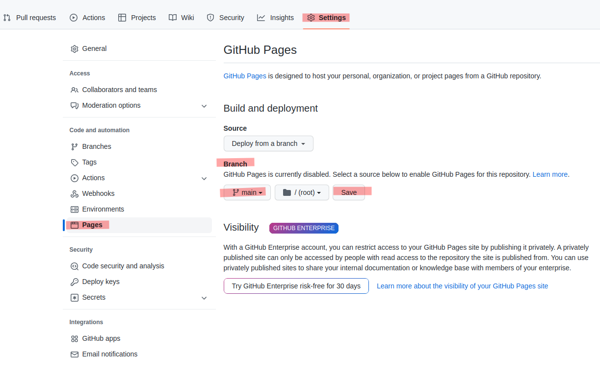

### Descripción
>Vamos a preparar nuestro marco de trabajo con VSCode i GitHub

### Paso 0 -Instalar VSCode

* Instalar VsCode  [https://code.visualstudio.com/download](https://code.visualstudio.com/download){target=_blank}

 
### Paso 1 -Añadir proyecto a VSCode

* Abrimos VSCode  y añadimos directorio clonado **/geoweb** ```File -->Add folder to workspace```


!!! warning "Si nos pregunta: **Do you trust the authors of the files in this folder?**"
    YES!!

### Paso 2 -Instalamos extensiones de VsCode

* En VsCode vamos a  ```View -->Extensions```

* Instalamos  **Live Server**  para poder visualizar páginas web como servidor local http

* Instalamos **Prettier - Code formatter** para identar nuestro código

 


### Paso 3 - Creamos página html

* Situamos puntero encima de **geoweb** botón derecho del mouse --> ```New File``` y creamos **index.html**

* Copiamos el siguiente código HTML de la que será nuestra página de inicio 


```html 
<html lang="es">
<head>
  <title>Mis mapas M2B</title>
  <meta charset="utf-8" />
  <meta name="viewport" content="width=device-width, initial-scale=1.0">
  <meta name="author" content="autor" />
  <meta name="description" content="descripción página">
  <meta name="robots" content="index,follow">
</head>
<body>
  <h2>Mis mapas del módulo M2B</h2>
  <h4>MapboxGLJS</h4>
  <ul>
    <li></li>
    <li></li>
    <li></li>
  </ul>
  <hr />
  <h4>StoryTelling</h4>
  <ul>
    <li></li>
    <li></li>
    <li></li>
  </ul>
  <hr />
  <h4>KeplerGL</h4>
  <ul>
    <li></li>
    <li></li>
    <li></li>
  </ul>
  <hr />
  <h4>Prácticas</h4>
  <ul>
    <li></li>
    <li></li>
    <li></li>
  </ul>
  <hr />
</body>
</html>

``` 
     
Guardamos archivo ```crtl + s```

### Paso 3 - Visualizamos archivo

!!! warning "Atencion!!"
    Para visualizar un archivo HTML **NO es recomendable** hacerlo cómo si fuera un archivo local **file://**, es decir "doble-click" sobre el archivo, ya que podria contener código JavaScript que que no se ejecutara correctamente (por ejemplo todo aquello a cargar contenido a partir de rutas relativas a un recurso web).

    **SIEMPRE** visualizar archivos HTML via **http://**. 

Para ello hemos instalado la extensión Live Server

* Situamos puntero encima de **index.html** botón derecho del mouse --> ```Open with Live Server``` 


### Paso 4 -Subir cambios a GitHub

#### Abrimos una terminal en VSCode, dos formas de hacerlo:
 
 * Situamos puntero encima de **geoweb** botón derecho del mouse --> ```Open in integrated terminal`` 
 
 * Barra de menú de VsCode  ```View --> Terminal``` y dentro de la terminal escribimos (linea + tecla Enter)


Escribimos ordenes GIT, hacemos tecla Enter en cada instrucción

```sh
git pull
```
```sh
git add .
```
```sh
git commit -m "add index.html"
```
```sh
git push -u origin main
```

!!! warning "Si al hacer *git pull* nos dice que no reconoce el comando GIT y hemos podido clonar el proyecto"

    * Hay que cambiar el tipo de teminal de **powershell** a **bash** en VSCode


!!! warning "Si al hacer commit la primera vez tenemos este aviso"

    ```bash 
    Run 

    git config --global user.email "you@example.com"
    git config --global user.name "Your Name"

    to set your account's default identity.
    Omit --global to set the identity only in this repository.

    fatal: unable to auto-detect email address (got 'usuario@yourpc.(none)')
    ```


!!! Tip "Entramos nuestor usuario de git y volvemos a hacer push"

    ```sh

    git config --global user.email micorreo@gmail.com
    git config --global user.name  misusuario

    git pull
    git add .
    git commit -m "add index.html"
    git push -u origin main       

   
    ```

La primera vez puede ser que tengamos que autentificarnos en GitHub


!!! summary "Al final cada vez que subamos cambios debemos escribir estas 4 lineas"
    ```sh
    git pull
    git add .
    git commit -m "mensaje commit"
    git push origin main

    ```


### Paso 5 - GitHub como web hosting

* Para convertir el repo en una página web, vamos a nuestro proyecto **geoweb** en **github.com**
* PVemos que el archivo **index.html** de ha subido correctamente
* Seleccionamos opción **Settings** --> **Pages**
* Branch -->Source opción **main** --> **Save**



* Una vez guardada veremos nuestro dominio


!!! question "Editamos repositorio con nuestro dominio y palabras clave"
    https://{nuestro-usuario}.github.io/geoweb/


## Práctica no puntuable con GitHub


!!! question "Editar index.html"

    La pagina index.html no tiene estilo. ¿Podriás añadir css y divs para maquetar mejor la pàgina.
    Puedes utlizar librerías com [Bootstrap](https://getbootstrap.com/) o [Materialize](https://materializecss.com/) para un mejor diseño

   

!!! tip "pista"

     Recuerda que al final cada vez que subamos cambios debemos escribir estas 4 lineas

    ```sh
    git pull
    git add .
    git commit -m "mensaje commit"
    git push origin main

    ```

!!! example "Ejemplo con Bootstrap"

``` html
<html  lang="es">
<head>
  <title>Mis mapas M2B</title>
  <meta charset="utf-8" />
  <meta name="viewport" content="width=device-width, initial-scale=1.0">
  <meta name="author" content="autor" />
  <meta name="description" content="descripción página">
  <meta name="robots" content="index,follow">
  <link rel="stylesheet" href="https://stackpath.bootstrapcdn.com/bootstrap/4.3.1/css/bootstrap.min.css"
    integrity="sha384-ggOyR0iXCbMQv3Xipma34MD+dH/1fQ784/j6cY/iJTQUOhcWr7x9JvoRxT2MZw1T" crossorigin="anonymous">
  <link rel="preconnect" href="https://fonts.gstatic.com">
  <link href="https://fonts.googleapis.com/css2?family=Inconsolata&display=swap" rel="stylesheet">
  <style>
    .seccion {
      border-radius: 0px !important;
    }
    .container {
      margin-top: 5px;
    }
    .storytelling {
      background-color: #e7e7f1;
    }
    .kepler {
      background-color: #f1e7ea;
    }
    .practicas {
      background-color: #e7f0f1;
    }
    .MapboxGLJS {
      background-color: #e7f1e8;
    }
    small {
      font-size: 60% !important;
    }
    .navbar {
      background-color: #f1e9e7 !important;
      border-radius: 0px !important;
    }
    .row {
      margin-top: 10px;
    }
    body {
      font-family: 'Inconsolata', sans-serif !important;
      font-size: 16px !important;
    }
    @media screen and (max-width: 500px) {
      body {
        font-size: 80% !important;
      }
    }
  </style>
</head>
<body>
  <div class="container">
    <nav class="navbar navbar-light bg-light">
      <h4>
        Mis mapas módulo M2B
        <br>
        <small>
          Mapas y OpenData, Localización, Visualización y Análisis de GeoDatos
        </small>
      </h4>
    </nav>
    <br>
    <div class="alert seccion MapboxGLJS">
      <h5>Mapas MapboxGLJS</h5>
      <div class="row">
        <div class="col">
          <ul>
            <li>
              <!--añadir aqui entrada-->
            </li>
            <li>
              <!--añadir aqui entrada-->
            </li>
          </ul>
        </div>
      </div>
    </div>
    <div class="alert seccion storytelling">
      <h5>Mapas StoryTelling</h5>
      <div class="row">
        <div class="col">
          <ul>
           <li>
              <!--añadir aqui entrada-->
            </li>
            <li>
              <!--añadir aqui entrada-->
            </li>
          </ul>
        </div>
      </div>
    </div>
    <div class="alert seccion kepler">
      <h5>Kepler.Gl</h5>
      <div class="row">
        <div class="col">
          <ul>
            <li>
              <!--añadir aqui entrada-->
            </li>
            <li>
              <!--añadir aqui entrada-->
            </li>
          </ul>
        </div>
      </div>
    </div>
    <div class="alert seccion practicas">
      <h5>Prácticas puntuables</h5>
      <div class="row">
        <div class="col">
          <ul>
            <li>
              <!--añadir aqui entrada-->
            </li>
            <li>
              <!--añadir aqui entrada-->
            </li>
          </ul>
        </div>
      </div>
    </div>
  </div>
</body>
</html>

```


### Información anexa, para saber más

#### Para tener la documentación del curso en nuestro repositorio

* Entamos en https://github.com/gis-master-m2/m2-geoweb

* Pulsmos ociopn(superior-derecha) **fork**

#### Para recuperar (clonar) nuestro trabajo en otro pc, por ejemplo

Nos situamos en un directorio de nuestor PC.
Botón derecho del mouse -->"Git bash here"

```sh
git clone  https://github.com/{tu usuario git}/geoweb.git
```
!!! note
    Si no aparece "Git bash here", tienes que instalar el cliente GIT
    [https://git-scm.com/download/win](https://git-scm.com/download/win)

#### Para (clonar) clonar la doumentación del curso

Nos situamos en un directorio de nuestor PC.
Botón derecho del mouse -->"Git bash here"

```sh
git clone  https://github.com/gis-master-m2/m2-geoweb.git
```


#### Para actualizar-sincronizar documentacion

Nos situamos *dentro* del directorio del proyecto, por ejemplo geoweb o m2-geoweb.
Botón derecho del mouse -->"Git bash here"

```sh
git pull
```


#### Para crear un proyecto desde nuestro PC directament a Github
* Crearemos repo des de nuestro pc [Tutorial](https://help.github.com/articles/adding-an-existing-project-to-github-using-the-command-line/)

* Nos situamos dentro del directorio **geoweb** de nuestro servidor y abrimos termial git (botón derecho mouse y Git Bash here)

```sh
git init
git add .
git commit -m "proyecto geoweb"
git remote add origin https://github.com/{tu usuario git}/geoweb.git
git remote -v
git push -u origin main

```
Atentificamos con usuario y password  

<hr>

