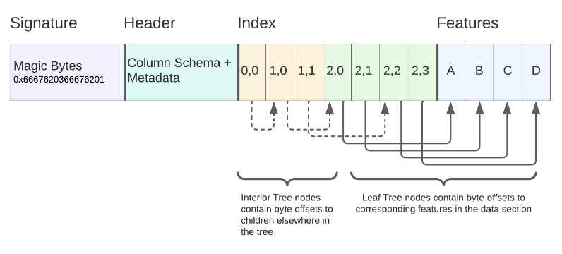

### Recursos

[https://flatgeobuf.org/](https://flatgeobuf.org/){target=_blank}

[https://worace.works/2022/03/12/flatgeobuf-implementers-guide/](https://worace.works/2022/03/12/flatgeobuf-implementers-guide/){target=_blank}

[https://flatgeobuf.org/examples/maplibre/large.html](https://flatgeobuf.org/examples/maplibre/large.html){target=_blank}

### FlatgeoBuf (*.fgb)

Flatgeobuf es un formato de almacenamiento de mapas vectoriales basado en protocol buffers, un sistema de serialización de datos. Es similar a Mapbox Vector Tiles (MVT) en su capacidad de almacenar mapas vectoriales en pequeños bloques o teselas y se puede utilizar con el encabezado HTTP Range para descargar solo los bloques necesarios.

El origen de Flatgeobuf es un proyecto de código abierto desarrollado por los miembros de la comunidad de software libre y geoespacial. Se basa en el estándar de protocol buffers, un sistema de serialización de datos desarrollado por Google, y en el estándar de mapas vectoriales desarrollado por Mapbox.

Flatgeobuf fue diseñado con el objetivo de proporcionar una alternativa a los formatos geoespaciales existentes, como GeoJSON y MVT (Mapbox Vector Tiles) y *tiene lo mejor de los dos formatos*, és serverless como GeoJson y binario como MVT.

El desarrollo de Flatgeobuf comenzó en *2018* como un proyecto de investigación de un grupo de desarrolladores de software libre y geoespaciales, buscando una forma de mejorar la eficiencia en el uso de recursos y la velocidad en la transmisión de datos geoespaciales. Flatgeobuf es un formato relativamente nuevo, pero ha sido adoptado por algunas aplicaciones y proyectos open source como por ejemplo Qgis y Gdal.

También es compatible con MapBox GL Js utilizando la libreria  [https://github.com/rowanwins/mapbox-gl-flatgeobuf](https://github.com/rowanwins/mapbox-gl-flatgeobuf){target=_blank}

#### Estructura interna 

