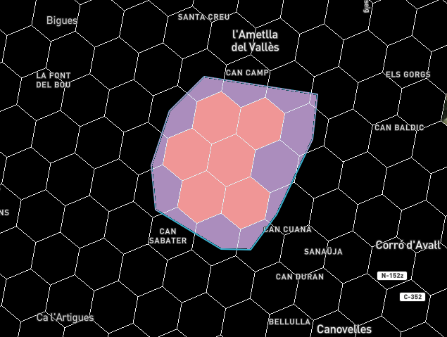
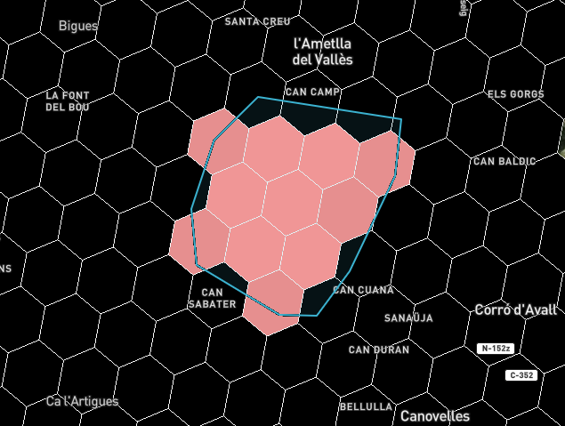

## ¿Cuantas personas viven aquí?

Nos han encargado realizar un mapa para poder saber cuanta gente vive en un zona de un 1km o 5km a la redonda --*buffer*-- o en cualquier zona que el usuario defina.

Nuestro mapa se centrará en España, però deberia ser exportable a cualquier otro país del mundo y ser facilmente escalable en un entorno *cloud* y preferiblemente *serverless*.

### Sabemos

- Que existe el formato **FlatGeoBuf**

- Conocemos [https://data.humdata.org/](https://data.humdata.org/){target=_blank} que utiliza datos de  [https://www.kontur.io/](https://www.kontur.io/){target=_blank}  de mallas de població H3 

- Podemos descargar los geodatos de España [https://data.humdata.org/dataset/kontur-population-spain](https://data.humdata.org/dataset/kontur-population-spain){target=_blank} pero también de hasta 248 paises [hhttps://data.humdata.org/dataset?ext_geodata=1&res_format=Geopackage&q=Hexagon&sort=if(gt(last_modified%2Creview_date)%2Clast_modified%2Creview_date)%20desc&ext_page_size=25](https://data.humdata.org/dataset?ext_geodata=1&res_format=Geopackage&q=Hexagon&sort=if(gt(last_modified%2Creview_date)%2Clast_modified%2Creview_date)%20desc&ext_page_size=25){target=_blank}


- Podemos utilizar el plugin de **mapbox-gl-draw** para dibujar puntos y polígonos

- Podemos utilizar **turfjs** para calcular buffers,  áreas y operaciones espaciales


### Ejemplo mapa población


#### Paso 0:Visualizar datos 
      
 *  Descargamos y guardamos los datos [datos/kontur_population_ES_20220630.fgb](datos/kontur_population_ES_20220630.fgb){target=_blank}  dentro del directorio **/geoweb/datos/** 


!!! tip "Con Qgis podemos convertir de GeoPackage a FlatGeoBuf con EPSG:4326"


#### Paso 1: Crear archivo poblacion.html dentro de /geoweb

!!! info "Aprovechamos para:"
    - Añadir libreria de flatgeobuf-geojson.min.js
    - Añadir libreria TurfJs
    - Añadir libreria y control de geocoder con parámetro *countries=ES*  [https://en.wikipedia.org/wiki/ISO_3166-1_alpha-2](https://en.wikipedia.org/wiki/ISO_3166-1_alpha-2){target=_blank}
    - Añadir utils.js
 

```html hl_lines="10-13 17 40-46"
<html>

<head>
    <meta charset='utf-8' />
    <title>Población</title>
    <meta name='viewport' content='initial-scale=1,maximum-scale=1,user-scalable=no' />
    <script src='https://api.mapbox.com/mapbox-gl-js/v2.11.0/mapbox-gl.js'></script>
    <link href='https://api.mapbox.com/mapbox-gl-js/v2.11.0/mapbox-gl.css' rel='stylesheet' />

    <script src="https://api.mapbox.com/mapbox-gl-js/plugins/mapbox-gl-geocoder/v5.0.0/mapbox-gl-geocoder.min.js"></script>
    <link rel="stylesheet" href="https://api.mapbox.com/mapbox-gl-js/plugins/mapbox-gl-geocoder/v5.0.0/mapbox-gl-geocoder.css" type="text/css">
    <script src="https://unpkg.com/flatgeobuf@3.24.0/dist/flatgeobuf-geojson.min.js"></script>
    <script src="https://cdn.jsdelivr.net/npm/@turf/turf@6.5.0/turf.min.js"></script>

    <link href='css/estilobase.css' rel='stylesheet' />

     <script src='js/utils.js'></script>


    <script>
        //Añadir vuestor token y/o estilo !!
        var map;
        function init() {
            mapboxgl.accessToken =
                'pk.eyJ1IjoiZ2lzbWFzdGVybTIiLCJhIjoiY2plZHhubTQxMTNoYzMza3Rqa3kxYTdrOCJ9.53B1E6mKD_EQOVb2Y0-SsA';
            map = new mapboxgl.Map({
                container: 'map',
                style: 'mapbox://styles/mapbox/satellite-streets-v11',
                center: [2.16859, 41.3954],
                zoom: 12,
                attributionControl: false,
                hash: true
            });

            map.addControl(new mapboxgl.AttributionControl({
                compact: true
            }));
            map.addControl(new mapboxgl.NavigationControl());

            map.addControl(
                new MapboxGeocoder({
                accessToken: mapboxgl.accessToken,
                mapboxgl: mapboxgl,
                collapsed:true,
                countries:'ES'
                }));

        } // final init
    </script>
</head>

<body onload="init()">
    <div id="map"></div>
</body>

</html>
```


#### Paso 2: Crear archivo *poblacion.js* dentro de */geoweb/js*

Implementaremos funciones para llamar al archivo flatGeobuf de forma genérica y filtrando por caja de coordenadas


```javascript
function getBounds() {
    const bounds = map.getBounds();
    var bbox = {
        minX: bounds.getWest(), //map.getBounds()._sw.ln
        minY: bounds.getSouth(), //map.getBounds()._sw.lat
        maxX: bounds.getEast(), //map.getBounds()._ne.lng
        maxY: bounds.getNorth(), //map.getBounds()._ne.lat
    };

    return bbox;
}

var datosH3Geojson;  // variable global

async function getFeaturesFGB(urlDatos, minZoom) {

    if (!map.getSource("mallaH3")) {

        map.addSource("mallaH3", {
            type: "geojson",
            data: null,
        });
        map.addLayer({
            id: "hexagonos",
            type: "fill",
            source: "mallaH3",
            minZoom: minZoom,
            paint: {
                "fill-color": "#0000ff",
                "fill-outline-color": "#ffffff",
                "fill-opacity": 0.1,  //trasparente
            },
        });


    }

     datosH3Geojson = { type: "FeatureCollection", features: [] };
    if (minZoom <= map.getZoom()) {

        var bbox = getBounds();

        var hexagonosH3GeoJson = flatgeobuf.deserialize(urlDatos, bbox);

        for await (let feature of hexagonosH3GeoJson) {

            datosH3Geojson.features.push(feature);
        }
        map.getSource("mallaH3").setData(datosH3Geojson);
    }else{
        map.getSource("mallaH3").setData(datosH3Geojson);
    }

    return datosH3Geojson;
}

```
#### Paso 3: Llamamos a la funcion *getFeaturesFGB* en *poblacion.html*

- Llamamos a poblacion.js
- Creamos dos variables , para parametrizar el archivo fgb i su límite de visualización

```javascript
 var url = "./datos/kontur_population_ES_20220630.fgb";
 var minZoom = 10;
```

- Llamos la función getFeaturesFGB des de los eventos del mapa: *load*,*moveed*,*zoomend*

```html hl_lines="18 23-24 50-60"
<html>

<head>
    <meta charset='utf-8' />
    <title>Población</title>
    <meta name='viewport' content='initial-scale=1,maximum-scale=1,user-scalable=no' />
    <script src='https://api.mapbox.com/mapbox-gl-js/v2.11.0/mapbox-gl.js'></script>
    <link href='https://api.mapbox.com/mapbox-gl-js/v2.11.0/mapbox-gl.css' rel='stylesheet' />

    <script src="https://api.mapbox.com/mapbox-gl-js/plugins/mapbox-gl-geocoder/v5.0.0/mapbox-gl-geocoder.min.js"></script>
    <link rel="stylesheet" href="https://api.mapbox.com/mapbox-gl-js/plugins/mapbox-gl-geocoder/v5.0.0/mapbox-gl-geocoder.css" type="text/css">
    <script src="https://unpkg.com/flatgeobuf@3.24.0/dist/flatgeobuf-geojson.min.js"></script>
    <script src="https://cdn.jsdelivr.net/npm/@turf/turf@6.5.0/turf.min.js"></script>

    <link href='css/estilobase.css' rel='stylesheet' />

     <script src='js/utils.js'></script>
     <script src='js/poblacion.js'></script>

    <script>
        //Añadir vuestor token y/o estilo !!
        var map;       
        var url = "./datos/kontur_population_ES_20220630.fgb";
        var minZoom = 10;
        function init() {
            mapboxgl.accessToken =
                'pk.eyJ1IjoiZ2lzbWFzdGVybTIiLCJhIjoiY2plZHhubTQxMTNoYzMza3Rqa3kxYTdrOCJ9.53B1E6mKD_EQOVb2Y0-SsA';
            map = new mapboxgl.Map({
                container: 'map',
                style: 'mapbox://styles/mapbox/satellite-streets-v11',
                center: [2.16859, 41.3954],
                zoom: 12,
                attributionControl: false,
                hash: true
            });

            map.addControl(new mapboxgl.AttributionControl({
                compact: true
            }));
            map.addControl(new mapboxgl.NavigationControl());

            map.addControl(
                new MapboxGeocoder({
                accessToken: mapboxgl.accessToken,
                mapboxgl: mapboxgl,
                collapsed:true,
                countries:'ES'
                }));

            map.on("load", function () {
                getFeaturesFGB(url, minZoom);
            });

            map.on("moveend", function () {
                getFeaturesFGB(url, minZoom);
            });

            map.on("zoomend", function () {
                getFeaturesFGB(url, minZoom);
            });    

        } // final init
    </script>
</head>

<body onload="init()">
    <div id="map"></div>
</body>

</html>

```


!!! question "Probamos cambiar - *"fill-opacity": 1* - en getFeaturesFGB"


#### Paso 4: Añadimos el plugin para dibujar geometrías *mapbox-gl-draw*

!!! info "Vemos información del plugin"

    Web  [https://github.com/mapbox/mapbox-gl-draw](https://github.com/mapbox/mapbox-gl-draw){target=_blank}

    Ejemplo [https://docs.mapbox.com/mapbox-gl-js/example/mapbox-gl-draw/](https://docs.mapbox.com/mapbox-gl-js/example/mapbox-gl-draw/){target=_blank}

     API [https://github.com/mapbox/mapbox-gl-draw/blob/main/docs/API.md](https://github.com/mapbox/mapbox-gl-draw/blob/main/docs/API.md){target=_blank}


Para añadir la librerías:

```html
<script src='https://api.mapbox.com/mapbox-gl-js/plugins/mapbox-gl-draw/v1.3.0/mapbox-gl-draw.js'></script>
<link rel='stylesheet' href='https://api.mapbox.com/mapbox-gl-js/plugins/mapbox-gl-draw/v1.3.0/mapbox-gl-draw.css' type='text/css' />
```

Dentro de **poblacion.html** 

- Llamaremos a la libreria mapbox-gl-draw
- La añadimos como un control 
- Activamos opciones de dibujar: Puntos, Polígonos y Borrar

```html hl_lines="13-14 29 56-72"
<html>

<head>
    <meta charset='utf-8' />
    <title>Población</title>
    <meta name='viewport' content='initial-scale=1,maximum-scale=1,user-scalable=no' />
    <script src='https://api.mapbox.com/mapbox-gl-js/v2.11.0/mapbox-gl.js'></script>
    <link href='https://api.mapbox.com/mapbox-gl-js/v2.11.0/mapbox-gl.css' rel='stylesheet' />

    <script src="https://api.mapbox.com/mapbox-gl-js/plugins/mapbox-gl-geocoder/v5.0.0/mapbox-gl-geocoder.min.js"></script>
    <link rel="stylesheet" href="https://api.mapbox.com/mapbox-gl-js/plugins/mapbox-gl-geocoder/v5.0.0/mapbox-gl-geocoder.css" type="text/css">

    <script src='https://api.mapbox.com/mapbox-gl-js/plugins/mapbox-gl-draw/v1.3.0/mapbox-gl-draw.js'></script>
    <link rel='stylesheet' href='https://api.mapbox.com/mapbox-gl-js/plugins/mapbox-gl-draw/v1.3.0/mapbox-gl-draw.css' type='text/css' />

    <script src="https://unpkg.com/flatgeobuf@3.24.0/dist/flatgeobuf-geojson.min.js"></script>
    <script src="https://cdn.jsdelivr.net/npm/@turf/turf@6.5.0/turf.min.js"></script>

    <link href='css/estilobase.css' rel='stylesheet' />

    <script src='js/utils.js'></script>
    <script src='js/poblacion.js'></script>

    <script>
        //Añadir vuestor token y/o estilo !!
        var map;
        var url = "./datos/kontur_population_ES_20220630.fgb";
        var minZoom = 10;
        var draw;

        function init() {
            mapboxgl.accessToken =
                'pk.eyJ1IjoiZ2lzbWFzdGVybTIiLCJhIjoiY2plZHhubTQxMTNoYzMza3Rqa3kxYTdrOCJ9.53B1E6mKD_EQOVb2Y0-SsA';
            map = new mapboxgl.Map({
                container: 'map',
                style: 'mapbox://styles/mapbox/satellite-streets-v11',
                center: [2.16859, 41.3954],
                zoom: 12,
                attributionControl: false,
                hash: true
            });

            map.addControl(new mapboxgl.AttributionControl({
                compact: true
            }));
            map.addControl(new mapboxgl.NavigationControl());

            map.addControl(
                new MapboxGeocoder({
                    accessToken: mapboxgl.accessToken,
                    mapboxgl: mapboxgl,
                    collapsed: true,
                    countries: 'ES'
                }));

            draw = new MapboxDraw({
                displayControlsDefault: false,
                controls: {
                    point: true,
                    polygon: true,
                    trash: true
                }
            });
            map.addControl(draw);

            map.on('draw.modechange', function (e) {
                //solo una geometria en el mapa
                var ff = draw.getAll();
                if (ff.features.length == 2) {
                    draw.delete(ff.features[0].id);
                }
            });

            map.on("load", function () {
                getFeaturesFGB(url, minZoom);
            });

            map.on("moveend", function () {
                getFeaturesFGB(url, minZoom);
            });

            map.on("zoomend", function () {
                getFeaturesFGB(url, minZoom);
            });

        } // final init
    </script>
</head>

<body onload="init()">
    <div id="map"></div>
</body>

</html>

```


#### Paso 5: Funcion asíncrona creaBuffer y funcion borraBuffer

Vamos a *poblacion.js* y creamos la funcion generica para crear un buffer con tufjs

!!! info "Utilizaremos esta función de Turfjs"
    [https://turfjs.org/docs/#buffer](https://turfjs.org/docs/#buffer){target=_blank}


```javascript
async function creaBuffer(featurePunto, distancia, unidades) {

    if (!map.getSource("buffer")) {

        map.addSource("buffer", {
            type: "geojson",
            data: null,
        });
        map.addLayer({
            id: "buffer",
            type: "fill",
            source: "buffer",
            paint: {
                "fill-color": "#3bb2d0",
                "fill-outline-color": "#ffffff",
                "fill-opacity": 0.4, //trasparente
            },
        });

    }

    var bufferFeature = turf.buffer(featurePunto, distancia, {
        units: unidades
    });
    var bufferGeojson = turf.featureCollection([bufferFeature]);
    map.getSource("buffer").setData(bufferGeojson);

    return bufferFeature;

}

function borraBuffer(){
   
    if (map.getSource("buffer")) {
        map.getSource("buffer").setData( {
            type: "FeatureCollection",
            features: []
        });
    }   

}

```


#### Paso 6: Funcion asíncrona calculaPoblacion

Vamos a *poblacion.js* y creamos la funcion calcular la población 
Utilizando Turfjs calcularemos la población proporcionalmente según el área intersectada entre el polígon o buffer creado por el usuario y los hexágonos contenidos

Aproximación por intersección propocional (la nuestra)



Aproximación por centroide



Para calcular la proporción de población haremos

```
AreaHexágono ---> PoblacionHexágono

AreaInterseccion --->  X
```
```
X= (AreaInterseccion * PoblacionHexágono) / AreaHexágono
```

!!! info "Utilizaremos estas funciones de Turfjs"
    [https://turfjs.org/docs/#area](https://turfjs.org/docs/#area){target=_blank}

    [https://turfjs.org/docs/#booleanWithin](https://turfjs.org/docs/#booleanWithin){target=_blank}

    [https://turfjs.org/docs/#booleanIntersects](https://turfjs.org/docs/#booleanIntersects){target=_blank}

    [https://turfjs.org/docs/#intersect](https://turfjs.org/docs/#intersect){target=_blank}


```javascript
async function calculaPoblacion(geometriaMapa) {

    var poblacion = 0;
    var areaGeometriaMapa = turf.area(geometriaMapa);
    for (var i = 0; i < datosH3Geojson.features.length; i++) {


        if (turf.booleanWithin(datosH3Geojson.features[i], geometriaMapa)) {
            poblacion = poblacion + datosH3Geojson.features[i].properties.population;

        } else if (turf.booleanIntersects(datosH3Geojson.features[i], geometriaMapa)) {
            var poblacionHexagono = datosH3Geojson.features[i].properties.population;
            var areaHexagono = turf.area(datosH3Geojson.features[i]);
            var geometriaIntersecion = turf.intersect(datosH3Geojson.features[i], geometriaMapa);
            var areaIntersecion = turf.area(geometriaIntersecion);

            /*
            console.info("poblacionHexagono",poblacionHexagono);
            console.info("areaHexagono",areaHexagono);
            console.info("geometriaIntersecion",geometriaIntersecion);
            console.info("areaIntersecion",areaIntersecion);
            console.info("calculo poblacion",parseInt(areaIntersecion * poblacionHexagono / areaHexagono));
            */
            poblacion = poblacion + parseInt(areaIntersecion * poblacionHexagono / areaHexagono);

        }

    }
  
    return {"poblacion":poblacion,"area":(areaGeometriaMapa/1000000).toFixed(2)};

}

```

#### Paso 7: Funcion  gestionCalculoPoblacion

Vamos a *poblacion.js* y creamos la funcion gestionCalculoPoblacion, para gestionar

- Si el usuario ha dibujado un punto y tenemos que crear un buffer
- Si el usuario ha dibujado un polígono
- El nivel de zoom en que estamos trabajando

```javascript
function gestionCalculoPoblacion(feature,minZoom){

    if (minZoom <= map.getZoom()) {

        if(feature.geometry.type =="Polygon"){
            calculaPoblacion(feature).then(function(resultado){
            document.getElementById('pop').innerHTML="Población:<b>"+resultado.poblacion+"</b><br>Área:<b>"+resultado.area+"</b>Km<sup>2</sup>";
            });
           }
           
           if(feature.geometry.type =="Point"){
            creaBuffer(feature,1000, 'meters').then(function(bufferFeature){

                calculaPoblacion(bufferFeature).then(function(resultado){

                document.getElementById('pop').innerHTML="Población:<b>"+resultado.poblacion+"</b><br>Área:<b>"+resultado.area+"</b>Km<sup>2</sup>";
                });

            });
           }
        
    }else{

        document.getElementById('pop').innerHTML="Cálculo de población a partir de zoom <b>"+minZoom+"</b>";
    }    

}

```


#### Paso 8: Llamos  gestionCalculoPoblacion en eventos del draw

Vamos a *poblacion.html* llamamos la funcion gestionCalculoPoblacion en

- Al dibujar un geometria , evento *draw.create*
- Al actualizar una geometria, evento *draw.update*
  
 Tambien creamos un ```<div>``` para mostrar los resultados 

```html hl_lines="71 87-93 101-103"
<html>

<head>
    <meta charset='utf-8' />
    <title>Población</title>
    <meta name='viewport' content='initial-scale=1,maximum-scale=1,user-scalable=no' />
    <script src='https://api.mapbox.com/mapbox-gl-js/v2.11.0/mapbox-gl.js'></script>
    <link href='https://api.mapbox.com/mapbox-gl-js/v2.11.0/mapbox-gl.css' rel='stylesheet' />

    <script src="https://api.mapbox.com/mapbox-gl-js/plugins/mapbox-gl-geocoder/v5.0.0/mapbox-gl-geocoder.min.js"></script>
    <link rel="stylesheet" href="https://api.mapbox.com/mapbox-gl-js/plugins/mapbox-gl-geocoder/v5.0.0/mapbox-gl-geocoder.css" type="text/css">

    <script src='https://api.mapbox.com/mapbox-gl-js/plugins/mapbox-gl-draw/v1.3.0/mapbox-gl-draw.js'></script>
    <link rel='stylesheet' href='https://api.mapbox.com/mapbox-gl-js/plugins/mapbox-gl-draw/v1.3.0/mapbox-gl-draw.css' type='text/css' />

    <script src="https://unpkg.com/flatgeobuf@3.24.0/dist/flatgeobuf-geojson.min.js"></script>
    <script src="https://cdn.jsdelivr.net/npm/@turf/turf@6.5.0/turf.min.js"></script>

    <link href='css/estilobase.css' rel='stylesheet' />

    <script src='js/utils.js'></script>
    <script src='js/poblacion.js'></script>

    <script>
        //Añadir vuestor token y/o estilo !!
        var map;
        var url = "./datos/kontur_population_ES_20220630.fgb";
        var minZoom = 10;
        var draw;

        function init() {
            mapboxgl.accessToken =
                'pk.eyJ1IjoiZ2lzbWFzdGVybTIiLCJhIjoiY2plZHhubTQxMTNoYzMza3Rqa3kxYTdrOCJ9.53B1E6mKD_EQOVb2Y0-SsA';
            map = new mapboxgl.Map({
                container: 'map',
                style: 'mapbox://styles/mapbox/satellite-streets-v11',
                center: [2.16859, 41.3954],
                zoom: 12,
                attributionControl: false,
                hash: true
            });

            map.addControl(new mapboxgl.AttributionControl({
                compact: true
            }));
            map.addControl(new mapboxgl.NavigationControl());

            map.addControl(
                new MapboxGeocoder({
                    accessToken: mapboxgl.accessToken,
                    mapboxgl: mapboxgl,
                    collapsed: true,
                    countries: 'ES'
                }));

            draw = new MapboxDraw({
                displayControlsDefault: false,
                controls: {
                    point: true,
                    polygon: true,
                    trash: true
                }
            });
            map.addControl(draw);

            map.on('draw.modechange', function (e) {
                //solo una geometria en el mapa
                var ff = draw.getAll();
                if (ff.features.length == 2) {
                    draw.delete(ff.features[0].id);
                    borraBuffer();
                }
            });

            map.on("load", function () {
                getFeaturesFGB(url, minZoom);
            });

            map.on("moveend", function () {
                getFeaturesFGB(url, minZoom);
            });

            map.on("zoomend", function () {
                getFeaturesFGB(url, minZoom);
            });

            map.on('draw.create',function(e){             
                gestionCalculoPoblacion(e.features[0],minZoom);
            });

            map.on('draw.update',function(e){             
                gestionCalculoPoblacion(e.features[0],minZoom);
            });


        } // final init
    </script>
</head>

<body onload="init()">
    <div class="panelTopIzquierda">
        <label id="pop"></label>
    </div>
    <div id="map"></div>
</body>

</html>

```

!!! question "¿Podemos añadir canviar a *projection:globe* el mapa"

!!! question "¿Podemos canviar el mapa a 3D?"

!!! question "¿Podemos cambiar dinamicamente el valor del buffer a 5000 metros?"

!!! question "¿Podemos que la malla h3 sea visible o no para el usuario?"

!!! question "¿Podemos ver popup de los hexágonos, por algo hemos añadido la librería utils,no?"

!!! question "¿Añadimos Titulo?"

!!! question "¿Probamos con otro país?"

!!! question "¿Convertimos a PWA?"


!!! success "¿Subimos el ejemplo al GitHub?"
	
	```bash

		git pull
        git add .
        git commit -m "població"
        git push

	```   


### Saber más ...

Añadir un capa WMS a Mapbox GL, exemplo funcion addWMS()

Con WMS del servicio EFFIS - European Forest Fire Information System

```javascript
function addWMS() {


  map.addSource('wms-incencios', {
    'type': 'raster',
    'tiles': [
      'https://maps.wild-fire.eu/gwis?time=2023-02-04%2F2023-02-05&bbox={bbox-epsg-3857}&format=image/png&service=WMS&version=1.1.1&request=GetMap&srs=EPSG:3857&transparent=true&width=512&height=512&layers=modis.hs'
    ],
    'tileSize': 512
  });
  map.addLayer(
    {
      'id': 'wms',
      'type': 'raster',
      'source': 'wms-incencios',
      'paint': {}
    },

  );

}

```


