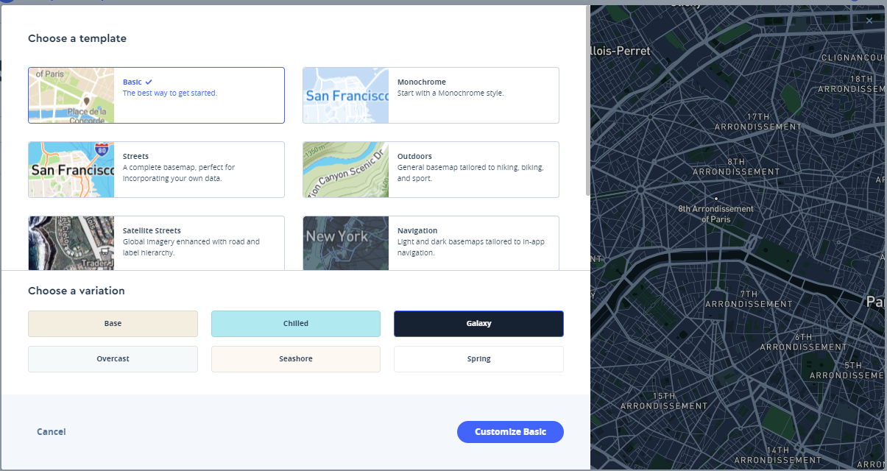
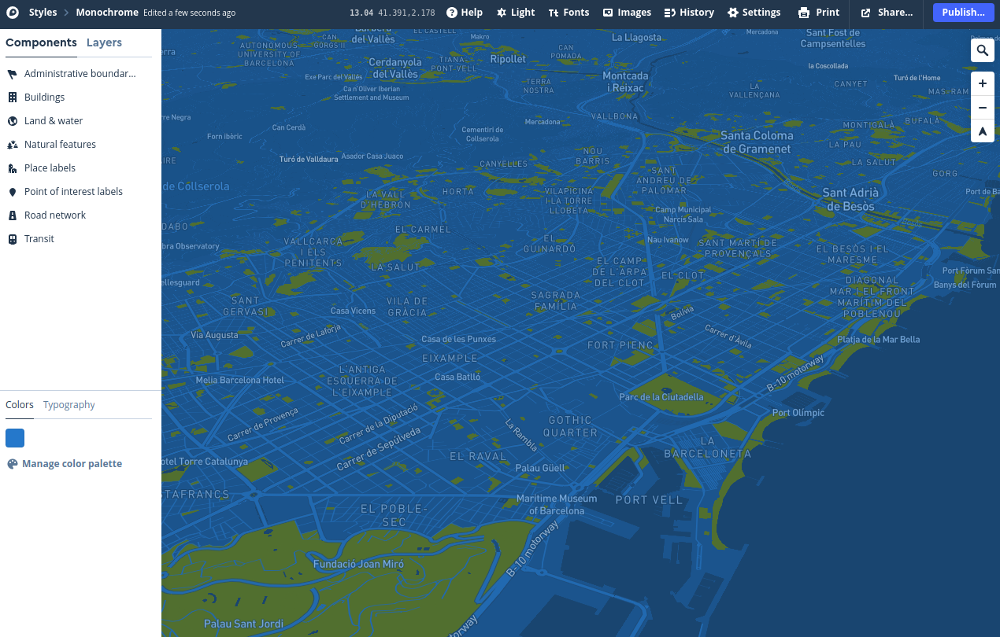
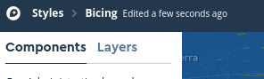
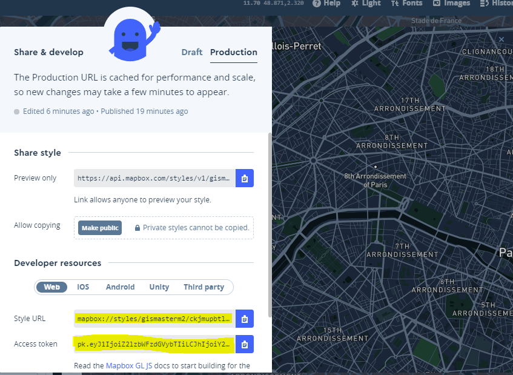

 
       
#### Web
* [https://www.mapbox.com/](https://www.mapbox.com/){target=_blank}

#### Productos
* [https://www.mapbox.com/products/](https://www.mapbox.com/products/){target=_blank}

#### APIs
* [https://www.mapbox.com/api-documentation/](https://www.mapbox.com/api-documentation/){target=_blank}

#### **Página referéncia MapBox GL!!**
* [https://www.mapbox.com/mapbox-gl-js/api/](https://www.mapbox.com/mapbox-gl-js/api/){target=_blank}

#### GitHUB
* [https://github.com/mapbox](https://github.com/mapbox){target=_blank}

#### Tutoriales
* [https://docs.mapbox.com/help/tutorials/?product=Mapbox+GL+JS](https://docs.mapbox.com/help/tutorials/?product=Mapbox+GL+JS){target=_blank}
* [https://www.mapbox.com/mapbox-gl-js/example/simple-map/](https://www.mapbox.com/mapbox-gl-js/example/simple-map/){target=_blank}
* [https://www.mapbox.com/help/tutorials/](https://www.mapbox.com/help/tutorials/){target=_blank}
* [https://www.mapbox.com/help/studio-manual/](https://www.mapbox.com/help/studio-manual/){target=_blank}
* [https://ovrdc.github.io/gis-tutorials/mapbox/](https://ovrdc.github.io/gis-tutorials/mapbox/){target=_blank}

#### Videos
* [https://www.youtube.com/watch?v=jrnoFU5Wkdo](https://www.youtube.com/watch?v=jrnoFU5Wkdo){target=_blank}
* [https://www.youtube.com/watch?v=Zn3Xx-TSrM8](https://www.youtube.com/watch?v=Zn3Xx-TSrM8){target=_blank}
* [https://www.youtube.com/watch?v=r6Ij_34xTD0](https://www.youtube.com/watch?v=r6Ij_34xTD0){target=_blank}
* [https://www.youtube.com/watch?v=YhynsA9_fPc](https://www.youtube.com/watch?v=YhynsA9_fPc){target=_blank}

### Descripción Mapbox

Mapbox es una plataforma para crear y utilizar mapas personalizados. Ofrece una variedad de herramientas y APIs para crear mapas interactivos, como la biblioteca JavaScript Mapbox GL JS y los Mapbox Maps SDKs para Android e iOS. Algunas de las características que ofrece Mapbox son:

Estilos de mapas personalizados: Mapbox te permite personalizar la apariencia de tus mapas creando tus propios estilos de mapa con Mapbox Studio o usando alguno de los muchos estilos prediseñados que están disponibles.

Geocodificación y reverse geocodificación: Mapbox ofrece servicios de geocodificación y reverse geocodificación, que permiten convertir direcciones y nombres de lugares en coordenadas geográficas y viceversa.

Datos en tiempo real: Mapbox puede mostrar datos en tiempo real en tus mapas, como información de tráfico, actualizaciones del tiempo, etc.

Navegación: Mapbox ofrece APIs de navegación y enrutamiento que se pueden utilizar para crear indicaciones paso a paso y otras funcionalidades de navegación para tus aplicaciones.

Imágenes de satélite: Mapbox proporciona acceso a imágenes de satélite y aéreas de alta resolución que se pueden superponer encima de tus mapas para proporcionar contexto adicional y detalle.

Mapbox es utilizado por una amplia gama de empresas y organizaciones, como Foursquare, The Weather Channel y el Censo de los Estados Unidos, entre otras.

     
###  ¿Cómo empezar?

!!! warning "Utilizamos nuestro correo de estudiante UPC!!"

> Nos creamos usuario en [MapBox.com](https://www.mapbox.com/signup/){target=_blank}

!!! tip "Cada usuario tiene un **Access Token** necessario para desarrollar y usar aplicaciones de Mapbox"
    De forma gratuita MapBox nos ofrece hasta 50.000 cargas cada mes

    

### Empezamos con MapBox Studio

#### Paso 1-Creamos nuestro propio estilo

* Entramos en https://account.mapbox.com/  seleccionamos nuestro avatar (parte superior-derecha) --> `Studio` 

 

* Dentro de Studio tenemos tres opciones básicas

| Opciones     | Descripción                         |
| ----------- | ------------------------------------ |
| **Styles**     | Para crear nuestros estilos pròpios |
| **Tilesets**       | Para subir nuestros datos y convertirlos en Vector Tiles y/o integrarlos con nuestros estilos |
| **Dataset**    | Para subir capas GeoJson que pueden ser convertidas a Tilesets |

* Seleccionamos -->`Styles` --> `New style`

* Seleccionamos un estilo como base (Base) y cambiamos variación colores (Galaxy) --> `Customize`

* Cambiamos nombre del estilo --Parte superior izquierda- por  "Bicing"

!!! note "Los colores y aspecto de nuestro mapa deben estar condicionados por aquello que querramos mostrar o para dar contexto a los datos que vamos a añadir"

#### Paso 2- Empezamos edición

* Podemos editar a dos niveles

    * Por components: Són agrupaciones de capas por temas, los cambios afectarán a todas las capas del tema (edición rápida)
    * Por capas: Editaremos capas de forma individual

* Para editar click encima del nombre del componente y(o layer)

!!! tip "Dedicamos 30 minutos a explorar i editar nuestro estilo"

#### Paso 3- Publicación

* Una vez hemos acabado -->`Publish your style` --> `Publish`

* Share, develop, and use your style

  * Share style -->`Preview only` --> Pegamos  URL en navegador
  * Developer resources --> `Style URL` y `Access token`  (copiamos para nuestras aplicaciones con Mapbox GL JS)

!!! tip "Truco"
    <h5>
    Si seleccionamos "Third party" también podemos consumir el estilo com WMTS (Raster) en Leaflet o QGIS!!
    </h5>
    

### Cartogram otra forma divertida de editar un estilo

* Buscamos y descargamos una foto, logo, etc..

 Nos vamos a  [https://apps.mapbox.com/cartogram/](https://apps.mapbox.com/cartogram/){target=_blank} y creamos otro estilo

