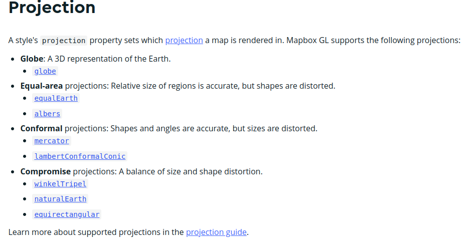

### Mapa con proyección global

Normalmente la liberias de mapas muestran los mapas en proyeccion ESPG:3857 o tambíen llamada "Web Mercator"

Esta proyección se utiliza comúnmente porque preserva ángulos y formas, lo que la hace adecuada para aplicaciones como mapas web que se muestran en una superficie plana. También se utiliza ampliamente porque permite una fácil conversión hacia y desde el Sistema Geodésico Mundial (WGS84), que es un sistema de coordenadas estándar utilizado para coordenadas GPS.

Pero toda proyección de la tierra sobre un plano, persentará deformaciones.


La libreria de Mapbox GL Js nos permite trabajar de forma adaptable con diferentes proyecciones


!!! info "El tipo de proyección es una opcion de mapboxgl.Map"
    
    [https://docs.mapbox.com/mapbox-gl-js/style-spec/projection/](https://docs.mapbox.com/mapbox-gl-js/style-spec/projection/){target=_blank}


 


### Creamos nuestro mapa global


#### Paso 1 Abrimos VSCODE y creamos **mapbox-global.html** dentro de nuestro directorio **/geoweb**

Copiamos el contenido de nuestro **mapbox-basico.html**

```html
<html lang="es">
  <head>
  <title>Mapbox básico</title>
    <meta charset="utf-8" />
    <meta name="viewport" content="width=device-width, initial-scale=1.0">
    <meta name="author" content="autor"/>
    <meta name="description" content="descripción página">
    <meta name="robots" content="index,follow">
    <link rel="stylesheet" href="https://api.mapbox.com/mapbox-gl-js/v2.11.0/mapbox-gl.css" />
    <script src="https://api.mapbox.com/mapbox-gl-js/v2.11.0/mapbox-gl.js"></script>
  <style>
  body {
    margin: 0;
    padding: 0;
    overflow: hidden;
  }
  #map {
    height: 100%;
    width: 100%;
  }
  </style>
  <script>
var map;  // tambien const map;
  function init() {
            mapboxgl.accessToken =
                'pk.eyJ1IjoiZ2lzbWFzdGVybTIiLCJhIjoiY2plZHhubTQxMTNoYzMza3Rqa3kxYTdrOCJ9.53B1E6mKD_EQOVb2Y0-SsA';
            map = new mapboxgl.Map({
                container: 'map',
                style: 'mapbox://styles/gismasterm2/ckyiybz965inm14pp3pd3981c',
                center: [2.16859, 41.3954],
                zoom: 13,
                attributionControl: false
            });
        map.addControl(new mapboxgl.AttributionControl({compact: true}));
        map.addControl(new mapboxgl.NavigationControl());
        }
  </script>
  </head>
  <body onLoad="init()">
  <div id="map"></div>
  </body>
  </html>
```


#### Paso 2 Cambiamos el estilo por estilo satellite y coordenadas y nivel de zoom

```html hl_lines="3 29-31"
<html lang="es">
  <head>
  <title>Mapbox global</title>
    <meta charset="utf-8" />
    <meta name="viewport" content="width=device-width, initial-scale=1.0">
    <meta name="author" content="autor"/>
    <meta name="description" content="descripción página">
    <meta name="robots" content="index,follow">
    <link rel="stylesheet" href="https://api.mapbox.com/mapbox-gl-js/v2.11.0/mapbox-gl.css" />
    <script src="https://api.mapbox.com/mapbox-gl-js/v2.11.0/mapbox-gl.js"></script>
  <style>
  body {
    margin: 0;
    padding: 0;
    overflow: hidden;
  }
  #map {
    height: 100%;
    width: 100%;
  }
  </style>
  <script>
var map;  // tambien const map;
  function init() {
            mapboxgl.accessToken =
                'pk.eyJ1IjoiZ2lzbWFzdGVybTIiLCJhIjoiY2plZHhubTQxMTNoYzMza3Rqa3kxYTdrOCJ9.53B1E6mKD_EQOVb2Y0-SsA';
            map = new mapboxgl.Map({
                container: 'map',
                style: 'mapbox://styles/mapbox/satellite-streets-v11',
                center: [0, 0],
                zoom: 2.3,
                attributionControl: false
            });
        map.addControl(new mapboxgl.AttributionControl({compact: true}));
        map.addControl(new mapboxgl.NavigationControl());
        }
  </script>
  </head>
  <body onLoad="init()">
  <div id="map"></div>
  </body>
  </html>

```


!!! success "Visualizamos"


#### Paso 3 - Añadimos proyección "globe" y efectos de ambiente

!!! note "En versiones V12 de estilos de Mapbox estos estan por defecto"


```html hl_lines="32 37-39"
<html lang="es">
  <head>
  <title>Mapbox global</title>
    <meta charset="utf-8" />
    <meta name="viewport" content="width=device-width, initial-scale=1.0">
    <meta name="author" content="autor"/>
    <meta name="description" content="descripción página">
    <meta name="robots" content="index,follow">
    <link rel="stylesheet" href="https://api.mapbox.com/mapbox-gl-js/v2.11.0/mapbox-gl.css" />
    <script src="https://api.mapbox.com/mapbox-gl-js/v2.11.0/mapbox-gl.js"></script>
  <style>
  body {
    margin: 0;
    padding: 0;
    overflow: hidden;
  }
  #map {
    height: 100%;
    width: 100%;
  }
  </style>
  <script>
var map;  // tambien const map;
  function init() {
            mapboxgl.accessToken =
                'pk.eyJ1IjoiZ2lzbWFzdGVybTIiLCJhIjoiY2plZHhubTQxMTNoYzMza3Rqa3kxYTdrOCJ9.53B1E6mKD_EQOVb2Y0-SsA';
            map = new mapboxgl.Map({
                container: 'map',
                style: 'mapbox://styles/mapbox/satellite-streets-v11',
                center: [0, 0],
                zoom: 2.3,
                projection:'globe',
                attributionControl: false
            });
        map.addControl(new mapboxgl.AttributionControl({compact: true}));
        map.addControl(new mapboxgl.NavigationControl());
        map.on('load', () => {
            map.setFog({}); 
        });

        }
  </script>
  </head>
  <body onLoad="init()">
  <div id="map"></div>
  </body>
  </html>

```

!!! info "Diferente codificación para hacer lo mismo"

        ```
        map.on('load', () => {
            map.setFog({}); 
        });
        ```
        es igual a

        ```
        map.on('load',function(){
            map.setFog({}); 
        });
        ```


!!! tip "**map.on("load")** es un evento del mapa !!"

        [https://docs.mapbox.com/mapbox-gl-js/api/map/#map-events](https://docs.mapbox.com/mapbox-gl-js/api/map/#map-events){target=_blank}


!!! success "Visualizamos"


#### Paso 3 - Añadimos el plugin de geocodificación

Los Plugins son controles extra encapsuladas fuera del core de la libreria

[https://docs.mapbox.com/mapbox-gl-js/plugins/](https://docs.mapbox.com/mapbox-gl-js/plugins/){target=_blank}


!!! info "Control mapbox-gl-geocoder"
    
    Ejemplo uso:
    [https://docs.mapbox.com/mapbox-gl-js/example/mapbox-gl-geocoder](https://docs.mapbox.com/mapbox-gl-js/example/mapbox-gl-geocoder){target=_blank}

     API:
    [https://github.com/mapbox/mapbox-gl-geocoder/blob/main/API.md#mapboxgeocoder](https://github.com/mapbox/mapbox-gl-geocoder/blob/main/API.md#mapboxgeocoder){target=_blank}


 Añadimos las librerias e instanciamos control   

```html hl_lines="12 13 45-50"
<html lang="es">
  <head>
  <title>Mapbox global</title>
    <meta charset="utf-8" />
    <meta name="viewport" content="width=device-width, initial-scale=1.0">
    <meta name="author" content="autor"/>
    <meta name="description" content="descripción página">
    <meta name="robots" content="index,follow">
    <link rel="stylesheet" href="https://api.mapbox.com/mapbox-gl-js/v2.11.0/mapbox-gl.css" />
    <script src="https://api.mapbox.com/mapbox-gl-js/v2.11.0/mapbox-gl.js"></script>

    <script src="https://api.mapbox.com/mapbox-gl-js/plugins/mapbox-gl-geocoder/v5.0.0/mapbox-gl-geocoder.min.js"></script>
    <link rel="stylesheet" href="https://api.mapbox.com/mapbox-gl-js/plugins/mapbox-gl-geocoder/v5.0.0/mapbox-gl-geocoder.css" type="text/css">
  <style>
  body {
    margin: 0;
    padding: 0;
    overflow: hidden;
  }
  #map {
    height: 100%;
    width: 100%;
  }
  </style>
  <script>
var map;  // tambien const map;
  function init() {
            mapboxgl.accessToken =
                'pk.eyJ1IjoiZ2lzbWFzdGVybTIiLCJhIjoiY2plZHhubTQxMTNoYzMza3Rqa3kxYTdrOCJ9.53B1E6mKD_EQOVb2Y0-SsA';
            map = new mapboxgl.Map({
                container: 'map',
                style: 'mapbox://styles/mapbox/satellite-streets-v11',
                center: [0, 0],
                zoom: 2.3,
                projection:'globe',
                attributionControl: false
            });
        map.addControl(new mapboxgl.AttributionControl({compact: true}));
        map.addControl(new mapboxgl.NavigationControl());
        map.on('load', () => {
            map.setFog({}); 
        });


                map.addControl(
                    new MapboxGeocoder({
                    accessToken: mapboxgl.accessToken,
                    mapboxgl: mapboxgl
                    })
                 );

        }
  </script>
  </head>
  <body onLoad="init()">
  <div id="map"></div>
  </body>
  </html>

```

!!! question "¿Cómo haríamos para que el control apareciera colapsado com un botón?"
    

!!! tip "Miramos opciones del control"
    
    [https://github.com/mapbox/mapbox-gl-geocoder/blob/main/API.md#mapboxgeocoder](https://github.com/mapbox/mapbox-gl-geocoder/blob/main/API.md#mapboxgeocoder){target=_blank}


!!! success "¿Subimos el ejemplo al GitHub?"
	
	```bash

		git pull
        git add .
        git commit -m "mapa global"
        git push

	```   

