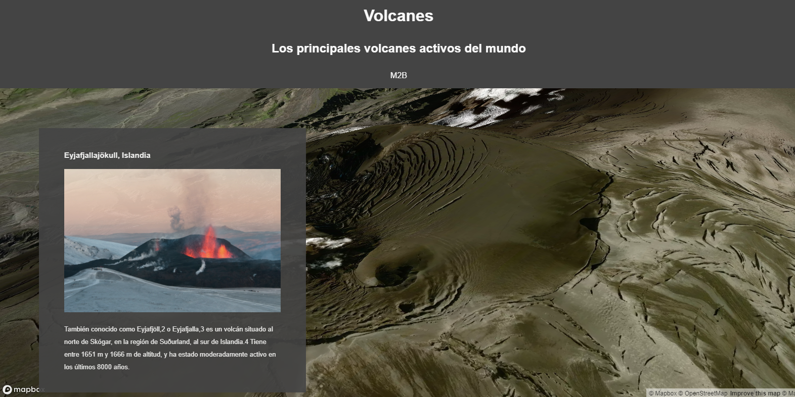

# StoryTelling
       
### Introducción

> Los **Storytelling** o **StoryMaps** són una combinación de mapas con textos narrativos, imágenes y contenido multimedia que nos permite crear un hilo narrativo para contar una historia

> Es un recurso muy utilizado por ejemplo en  publicaciones digitales.

> Si tenemos una historia que contar con una mapa, nos serà una herramienta muy útil.

> Ejemplo de StoryTelling [Save the Nile](https://interactive.aljazeera.com/aje/2020/saving-the-nile/index.html){target=_blank} publicado por AlJazeera

> Post [8 compelling stories told with the Storytelling solution](https://blog.mapbox.com/8-compelling-stories-told-with-the-storytelling-solution-3d33ab7b34e1){target=_blank}

### Información y templates

* [https://www.mapbox.com/solutions/interactive-storytelling](https://www.mapbox.com/solutions/interactive-storytelling){target=_blank}

* [https://github.com/mapbox/storytelling](https://github.com/mapbox/storytelling){target=_blank}
     
###  ¿Cómo empezar?

 * Mapbox ofrece un template para empezar a crear histórias sin apenas programación, básicamenten sólo habrá que editar un archivo de configuración.
 * Vamos descarganos [datos/storytelling.zip](datos/storytelling.zip) y descoprimiremos su contenido dentro del directorio de trabajo **geoweb**

* Observaremos que tenemos tres nuevos archivos

| Archivos    | Description                          |
| ----------- | ------------------------------------ |
| **storytelling.html**       | Archivo principal basado en template de mapbox |
| **config.js**       | Archivo de configuracion |
| **helper.html**    | Mapa de ayuda para capturar coordenadas i vistas |


Para saber más:[https://github.com/mapbox/storytelling#getting-started](https://github.com/mapbox/storytelling#getting-started){target=_blank}

!!! info "Para ver toda la sesión 4 ver  Videos 5 y 6"

### Nuestro StoryTelling

* Vamos a crear un storyTelling sobre los **principales volcanes en activos del mundo**

#### Paso 1: Visualizamos storytelling.html





* Si hacemos scroll veremos que sólo tenemos un volcan

* Necesitamos entender y editar el archivo **config.js** para poder añadir más contenido


#### Paso 2: Abrimos **config.js**

* Cambiamos el access token y ponemos el nuestro

```js hl_lines="3"

var config = {
    style: 'mapbox://styles/mapbox/satellite-v9',
    accessToken: 'pk.eyJ1IjoiZ2lzbWFzdGVybTIiLCJhIjoiY2plZHhubTQxMTNoYzMza3Rqa3kxYTdrOCJ9.53B1E6mKD_EQOVb2Y0-SsA',
    showMarkers: false,
    markerColor: '#3FB1CE',
    theme: 'dark',
    use3dTerrain: true,
    title: 'Volcanes',
    subtitle: 'Los principales volcanes activos del mundo',
    byline: 'M2B ',
    footer: 'Source: Wikipedia',
    chapters: [
        {
            id: 'volcan1',
            alignment: 'left',
            hidden: false,
            title: 'Eyjafjallajökull, Islandia',
            image: 'https://upload.wikimedia.org/wikipedia/commons/e/e4/Eyjafjallaj%C3%B6kull_first_crater_20100329.jpg',
            description: 'También conocido como Eyjafjöll,2​ o Eyjafjalla,3​ es un volcán situado al norte de Skógar, en la región de Suðurland, al sur de Islandia.4​ Tiene entre 1651 m y 1666 m de altitud,​ y ha estado moderadamente activo en los últimos 8000 años.',
            location: {
                center: [-19.62, 63.63],
                zoom: 13.5,
                pitch: 60,
                bearing: 0
            },
            mapAnimation: 'flyTo',
            rotateAnimation: true,
            callback: '',
            onChapterEnter: [
                // {
                //     layer: 'layer-name',
                //     opacity: 1,
                //     duration: 5000
                // }
            ],
            onChapterExit: [
                // {
                //     layer: 'layer-name',
                //     opacity: 0
                // }
            ]
        }
    ]
};

```

#### Las principales opciones del documento config son:


!!! note "Items en negrita son **obligatorios**."

**`style`**: Url estilo de MapBox , puede ser un nuestro propio

**`accessToken`**: Mapbox access token.

**`showMarkers`**: Mostrar un marker.

**`markerColor`**: Color hexadecimal del marker.

**`theme`**: Tema básico CSS (light o dark).

`use3dTerrain`: Activar 3D terrain. (Optional)

`title`: Título de la história. (Optional)

`subtitle`: Subtítulo (Optional)

`byline`: Créditos del autor. (Optional)

`footer`: Citatión de fuentes.

**`chapters`**: Es una matriz que contiene cada una de las visualizaciones (ítems) de la história

- **`id`**: id único que se assigna a un HTML `id` de un `div` .
- **`alignment`**: Define dónde va aparecer el texto de la história. Las opciones son; `center`, `left`, `right`, y `full`.
- `title`: Título de la sección.
- `image`: Imagen descriptiva.
- `description`: Descripción de la sección. Puede contener texto en formato HTML.
- **`location`**: Localización del mapa.
    - **`center`**: Centro del mapa en coordenadads `longitude, latitude`
    - **`zoom`**: Nivel de zoom.
    - **`pitch`**: Ángulo de inclinación de la cámara.
    - **`bearing`**: Rotación del mapa respeto al norte.
- `mapAnimation`: Define  [el tipo de animación](https://docs.mapbox.com/mapbox-gl-js/api/#map#jumpto) para la transición entre lugares. Soportas 'flyTo', 'easeTo', y 'jumpTo' animations. Per defecto es  `flyTo`.
- `rotateAnimation`: Si es  `true`. El mapa rotará 90 grados durante 24 segundos.
- `callback`: pPuede ejcutar una función de Javascript para por ejemplo mostrar un gràfico.
- `onChapterEnter`: Podemos cambiar partes del estilo de las capas al inciar la sección.
    - `layer`: Nombre de la capa.
    - `opacity`: Opacidad. `0` transparente, `1` opaca.
    - `duration`: Duración de la transisción en milisegundos. Por defecto 300..
- `onChapterExit`: lo mismo `onChapterEnter` pero al salir de la sección.


#### Paso 3: Añadimos un nuevo volcan

* Para añadir nuevo contenido tenemos que añadir item dentro de ```chapters```, cada item lo debemos separar por coma

```js hl_lines="42-60"

var config = {
    style: 'mapbox://styles/mapbox/satellite-v9',
    accessToken: 'pk.eyJ1IjoiZ2lzbWFzdGVybTIiLCJhIjoiY2plZHhubTQxMTNoYzMza3Rqa3kxYTdrOCJ9.53B1E6mKD_EQOVb2Y0-SsA',
    showMarkers: false,
    markerColor: '#3FB1CE',
    theme: 'dark',
    use3dTerrain: true,
    title: 'Volcanes',
    subtitle: 'Los principales volcanes activos del mundo',
    byline: 'M2B ',
    footer: 'Source: Wikipedia',
    chapters: [
        {
            id: 'volcan1',
            alignment: 'left',
            hidden: false,
            title: 'Eyjafjallajökull, Islandia',
            image: 'https://upload.wikimedia.org/wikipedia/commons/e/e4/Eyjafjallaj%C3%B6kull_first_crater_20100329.jpg',
            description: 'También conocido como Eyjafjöll,2​ o Eyjafjalla,3​ es un volcán situado al norte de Skógar, en la región de Suðurland, al sur de Islandia.4​ Tiene entre 1651 m y 1666 m de altitud,​ y ha estado moderadamente activo en los últimos 8000 años.',
            location: {
                center: [-19.62, 63.63],
                zoom: 13.5,
                pitch: 60,
                bearing: 0
            },
            mapAnimation: 'flyTo',
            rotateAnimation: true,
            callback: '',
            onChapterEnter: [
                // {
                //     layer: 'layer-name',
                //     opacity: 1,
                //     duration: 5000
                // }
            ],
            onChapterExit: [
                // {
                //     layer: 'layer-name',
                //     opacity: 0
                // }
            ]
       },{
            id: 'volcan2',
            alignment: 'right',
            hidden: false,
            title: 'Monte Vesubio, Italia',
            image: 'https://upload.wikimedia.org/wikipedia/commons/2/24/Cr%C3%A1ter_del_Vesubio.jpg',
            description: 'Es un volcán activo del tipo vesubiano situado frente a la bahía de Nápoles y a unos nueve kilómetros de distancia de la ciudad de Nápoles. Se encuentra en la ciudad metropolitana de Nápoles, perteneciente a la región italiana de la Campania. Tiene una altura máxima de 1281 m s. n. m. y se alza al sur de la cadena principal de los Apeninos.',
            location: {
                center: [14.42555555, 40.82138888],
                zoom: 14.5,
                pitch: 60,
                bearing: -43.2
            },
            mapAnimation: 'flyTo',
            rotateAnimation: true,
            callback: '',
            onChapterEnter: [],
            onChapterExit: []
        }
    ]
};

```


#### Paso 4: Subimos ejemplo a Github

!!! tip "Editamos también index.html "
	

	```bash

		git pull
        git add .
        git commit -m "storytelling"
        git push origin main

	```


### Práctica


!!! question "Intentamos añadir dos o más volcanes"
    Buscamos en la wikipedia información e imagenes 
   

!!! success "Intentamos mejorar el texto de la descripcion de los volcanes"
    Podemos añadir parte código HTML enla descripción cómo por ejemplo un **hipervínculo o un embed de un vídeo**

    Podemos intentar cambiar estilos CSS


!!! success "Volvemos a subir los cambios a GitHub"
	
	```bash

		git pull
        git add .
        git commit -m "añadidos más volcanes"
        git push origin main

	```       

!!! warning "Un StoryTelling podría ser un buen ejemplo de práctica final!!"