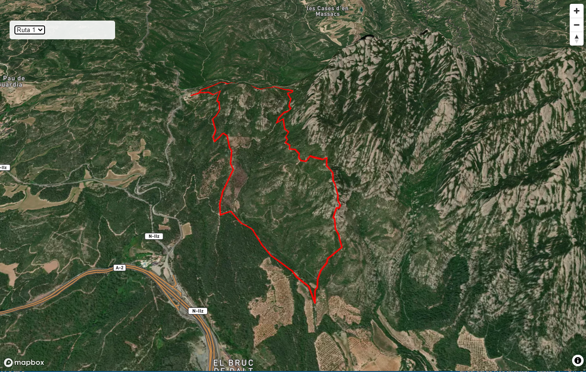

### Introducción
- Utilizando el mapa 3D vamos a crear un pequeño visor de rutas

- Dentro del directorio de **/geoweb/datos** tenmos el archivo **rutas.geojson** que contiene tres cuatro rutas


### Visor de rutas


#### Paso 1: Con VSCODE abrimos mapa3d.html i lo guardamos cómo mapa-rutas3d.html

* Cambiamos el título
* Cambiamos center y zoom para abrir mapa sobre una ruta

```html hl_lines="4 20 21"

    <html>
    <head>
    <meta charset='utf-8' />
    <title>Mapa rutas 3D</title>
    <meta name='viewport' content='initial-scale=1,maximum-scale=1,user-scalable=no' />
    <script src='https://api.mapbox.com/mapbox-gl-js/v2.12.0/mapbox-gl.js'></script>
    <link href='https://api.mapbox.com/mapbox-gl-js/v2.12.0/mapbox-gl.css' rel='stylesheet' />
    <link href='css/estilobase.css' rel='stylesheet' />
 
    <script src='js/3d.js'></script>
    <script>
        //Añadir vuestor token!!
        var map;
        function init() {
            mapboxgl.accessToken =
                'pk.eyJ1IjoiZ2lzbWFzdGVybTIiLCJhIjoiY2plZHhubTQxMTNoYzMza3Rqa3kxYTdrOCJ9.53B1E6mKD_EQOVb2Y0-SsA';
             map = new mapboxgl.Map({
                container: 'map',
                style: 'mapbox://styles/mapbox/satellite-streets-v10',
                center: [1.77878, 41.60044],
                zoom: 14,
                attributionControl: false,
                pitch: 45,
                hash: true
            });

            map.addControl(new mapboxgl.AttributionControl({ compact: true }));
            map.addControl(new mapboxgl.NavigationControl());

            map.on('load', function () {
             add3D();

            }); //fin onload         

        } // final init
    </script>
    </head>

    <body onload="init()">
        
        <div id="map"></div>
    </body>

    </html>

```

#### Paso 2: Creamos archivo rutas.js

 * Dentro de nuestro directorio **/geoweb/js/** creamos el archivo **rutas.js**, dónde crearemos funciones especificas de nuestro proyecto  

 * Creamos la función **addRutas()**

```javascript

   function addRutas() {

            var url = 'datos/rutas.geojson';
            map.addSource('rutas', { type: 'geojson', data: url});

                 map.addLayer({
            'id': 'route',
            'type': 'line',
            'source': 'rutas',
            'layout': {
            'line-join': 'round',
            'line-cap': 'round'
            },
            'paint': {
            'line-color': '#ff0000',
            'line-width': 3
            }
            });

} //fin funcion

```

#### Paso 3: Llamar función addRuta

* Llamamos a la función **addRuta()** y cambiamos coordenadas iniciales y nivel de zoom del mapa para empezar encima de una ruta

```html hl_lines="11 33"

    <html>
    <head>
    <meta charset='utf-8' />
    <title>Mapa rutas 3D</title>
    <meta name='viewport' content='initial-scale=1,maximum-scale=1,user-scalable=no' />
    <script src='https://api.mapbox.com/mapbox-gl-js/v2.12.0/mapbox-gl.js'></script>
    <link href='https://api.mapbox.com/mapbox-gl-js/v2.12.0/mapbox-gl.css' rel='stylesheet' />
    <link href='css/estilobase.css' rel='stylesheet' />
 
    <script src='js/3d.js'></script>
    <script src='js/rutas.js'></script>
    <script>
        //Añadir vuestor token!!
        var map;
        function init() {
            mapboxgl.accessToken =
                'pk.eyJ1IjoiZ2lzbWFzdGVybTIiLCJhIjoiY2plZHhubTQxMTNoYzMza3Rqa3kxYTdrOCJ9.53B1E6mKD_EQOVb2Y0-SsA';
             map = new mapboxgl.Map({
                container: 'map',
                style: 'mapbox://styles/mapbox/satellite-streets-v10',
                center: [1.77878, 41.60044],
                zoom: 14,
                attributionControl: false,
                pitch: 45,
                hash: true
            });

            map.addControl(new mapboxgl.AttributionControl({ compact: true }));
            map.addControl(new mapboxgl.NavigationControl());

            map.on('load', function () {
             add3D();
             addRutas();

            }); //fin onload         

        } // final init
    </script>
    </head>

    <body onload="init()">
        
        <div id="map"></div>
    </body>

    </html>
```


!!! note "Visualizamos mapa"


#### Paso 4: Opciones de seleción

 * Vamos a crear una funcionalidad para hacer zoom a las tres rutas

 * Creamos un elementos HTML de tipo `<select>` para poder seleccionar una ruta

```html hl_lines="42 43 44 45 46 47 48"

<html>
    <head>
    <meta charset='utf-8' />
    <title>Mapa rutas 3D</title>
    <meta name='viewport' content='initial-scale=1,maximum-scale=1,user-scalable=no' />
    <script src='https://api.mapbox.com/mapbox-gl-js/v2.12.0/mapbox-gl.js'></script>
    <link href='https://api.mapbox.com/mapbox-gl-js/v2.12.0/mapbox-gl.css' rel='stylesheet' />
    <link href='css/estilobase.css' rel='stylesheet' />
 
    <script src='js/3d.js'></script>
    <script src='js/rutas.js'></script>
    <script>
        //Añadir vuestor token!!
        var map;
        function init() {
            mapboxgl.accessToken =
                'pk.eyJ1IjoiZ2lzbWFzdGVybTIiLCJhIjoiY2plZHhubTQxMTNoYzMza3Rqa3kxYTdrOCJ9.53B1E6mKD_EQOVb2Y0-SsA';
             map = new mapboxgl.Map({
                container: 'map',
                style: 'mapbox://styles/mapbox/satellite-streets-v10',
                center: [1.77878, 41.60044],
                zoom: 14,
                attributionControl: false,
                pitch: 45,
                hash: true
            });

            map.addControl(new mapboxgl.AttributionControl({ compact: true }));
            map.addControl(new mapboxgl.NavigationControl());

            map.on('load', function () {
             add3D();
             addRutas();

            }); //fin onload         

        } // final init
    </script>
    </head>

    <body onload="init()">
        <div class="panelTopIzquierda">
            <select onChange="zoomToRutas(this.value)">
                <option selected value="14/41.60044/1.77878">Ruta 1</option>
                <option value="12.96/41.76589/2.30274">Ruta 2</option>
                <option value="13.04/42.31892/3.26054">Ruta 3</option>
            </select>
         </div>
        <div id="map"></div>
    </body>

    </html>

```

#### Paso 6: Función de zoomToRutas

 * Añadimos a  **rutas.js** la funcion **zoomToRutas()**

 * Utilizamos método [https://docs.mapbox.com/mapbox-gl-js/api/map/#map#flyto](https://docs.mapbox.com/mapbox-gl-js/api/map/#map#flyto)

``` javascript
   function zoomToRutas(valores) {

    var coord = valores.split("/");

    map.flyTo({
            center: [coord[2], coord[1]],
            zoom: coord[0]
        });

    } //fin funcion

```





!!! success "¿Subimos el ejemplo al GitHub?"
	
	```bash

		git pull
        git add .
        git commit -m "visor rutas"
        git push

	``` 


### Saber más ..

#### Añadir DEM externo a 3d.js

 * Mapbox utiliza un DEM de 10m y de 30 m según zonas del mundo

 * El ICGC publica uno de 2m para Catalunya  [https://openicgc.github.io/](https://openicgc.github.io/)

 * Modificamos la función ```add3D()``` 

 * Añadimos nueva función ```changeTerrain()``` para poder recibir un valor y acticar el terreno de MapBox, el del ICGC o ninguno.

```javascript hl_lines="1 10-17 21-26 43 48-59"

  function add3D(terreno) {

    map.addSource('mapbox-dem', {
        'type': 'raster-dem',
        'url': 'mapbox://mapbox.mapbox-terrain-dem-v1',
        'tileSize': 512,
        'maxzoom': 14
    });

    map.addSource('icgc-dem', {
        'type': 'raster-dem',
        "tiles": [
        "https://tilemaps.icgc.cat/tileserver/tileserver.php/terreny_icgc_2m_rgb/{z}/{x}/{y}.png"
      ],
        'tileSize': 512,
        'maxzoom': 14
    });

   map.setFog({});

   /* codigo para comentar
    map.setTerrain({
        'source': 'mapbox-dem',
        'exaggeration': 1.5
    });
    */

   map.addLayer({
        'id': '3d-buildings',
        'source': 'composite',
        'source-layer': 'building',
        'filter': ['==', 'extrude', 'true'],
        'type': 'fill-extrusion',
        'minzoom': 15,
        'paint': {
            'fill-extrusion-color': '#aaa',
            'fill-extrusion-height': ['get', 'height'],                    
            'fill-extrusion-opacity': 0.9
        }
    });


   changeTerrain(terreno);


} //fin funcion

function changeTerrain(terreno){

    if(terreno){
        map.setTerrain({
            'source': terreno,
            'exaggeration': 1.5
        });
    }else{
        map.setTerrain(null);
    }

} //fin funcion

```


#### Paso 6:Llamamos a la función en el HTML , pasando el parámetro


``` html hl_lines="31"
    <html>
    <head>
    <meta charset='utf-8' />
    <title>Mapa 3D</title>
    <meta name='viewport' content='initial-scale=1,maximum-scale=1,user-scalable=no' />
    <script src='https://api.mapbox.com/mapbox-gl-js/v2.12.0/mapbox-gl.js'></script>
    <link href='https://api.mapbox.com/mapbox-gl-js/v2.12.0/mapbox-gl.css' rel='stylesheet' />
    <link href='css/estilobase.css' rel='stylesheet' />
 
    <script src='js/3d.js'></script>
    <script>
        //Añadir vuestor token!!
        var map;
        function init() {
            mapboxgl.accessToken =
                'pk.eyJ1IjoiZ2lzbWFzdGVybTIiLCJhIjoiY2plZHhubTQxMTNoYzMza3Rqa3kxYTdrOCJ9.53B1E6mKD_EQOVb2Y0-SsA';
             map = new mapboxgl.Map({
                container: 'map',
                style: 'mapbox://styles/mapbox/satellite-streets-v10',
                center: [2.16859, 41.3954],
                zoom: 12,
                attributionControl: false,
                pitch: 45,
                hash: true
            });

            map.addControl(new mapboxgl.AttributionControl({ compact: true }));
            map.addControl(new mapboxgl.NavigationControl());

            map.on('load', function () {
             add3D('icgc-dem'); //mapbox-dem  o null
            
            }); //fin onload

        } // final init
    </script>
    </head>

    <body onload="init()">
        
        <div id="map"></div>
    </body>

    </html>

```

!!! success "Comparamos zona Montserrat"

!!! question "¿Cómo haríamos para poner una opción para activar/desactivar vista 3D y seleccionar el DEM Mapbox i el ICGC?"
    Sabémos que  ```map.setTerrain(null)``` desactiva el 3D

    ```
        <div>
            <input type="radio" onClick="changeTerrain(this.value)"  name="dem" value="mapbox-dem">Mapbox <br>
            <input type="radio" onClick="changeTerrain(this.value)" checked name="dem" value="icgc-dem">ICGC <br>
            <input type="radio"  onClick="changeTerrain(null)"  name="dem" >2D
          </div>  
    ```
