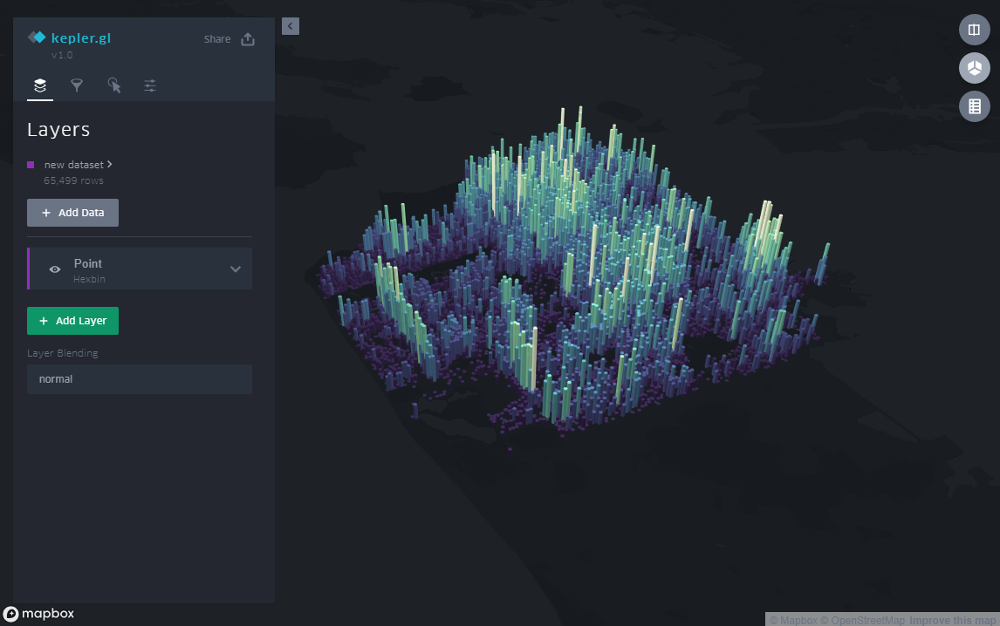
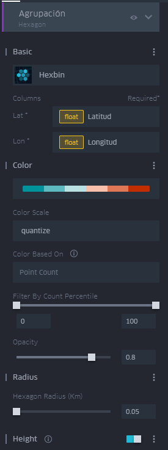
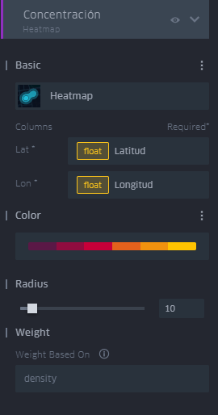
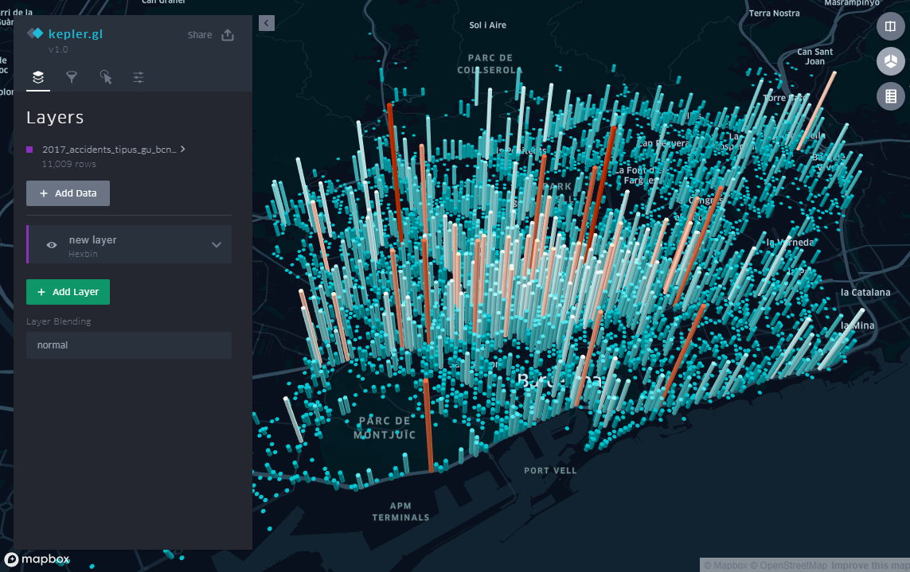
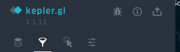
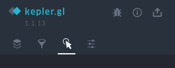
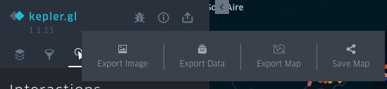
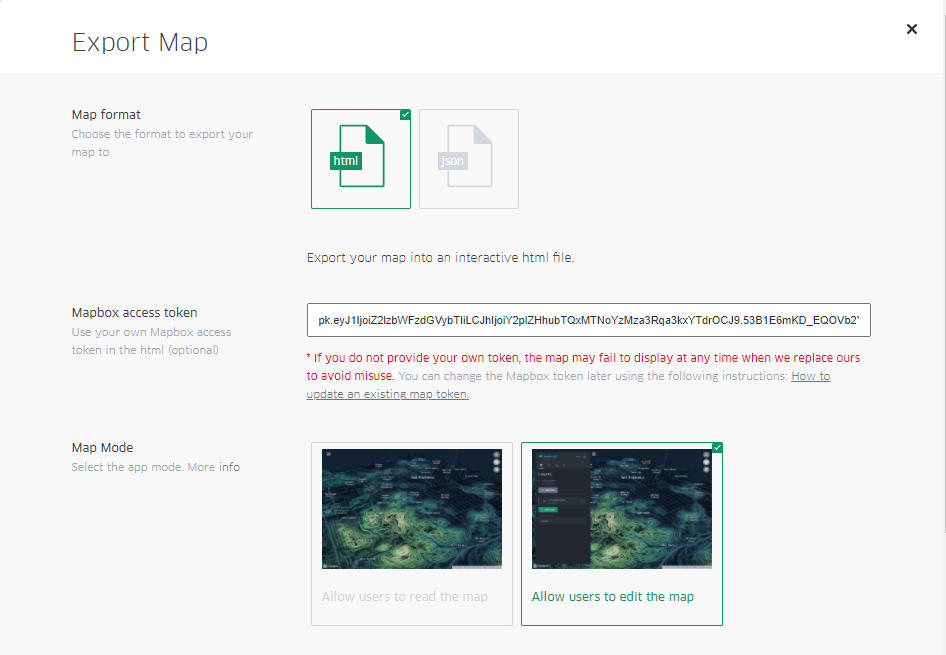

# Visualización y publicación con Kepler GL


### Descripción 

>Kepler.gl es una aplicación desarrollada por Uber, en un principio para uso interno, para analizar y visualizar sus propios datos.

>Esta basada en WebGL y pensada para  la exploración visual de conjuntos de datos de geolocalizaciós a gran escala. 

>Kepler.gl está construido en la parte superior de Deck.gl, la libreria de visualización también desarrollada por Uber.

>kepler.gl puede representar millones de puntos que representan miles de viajes y realizar agregaciones espaciales, bsadas por ejemplo en hexágonos.

>También es possible desarrollar sobre Kepler.gl ya que existe una API basada en el framework de JavaScript React + Redux


#### Web
* [https://kepler.gl/](https://kepler.gl/)

#### Aplicación
* [https://kepler.gl/demo](https://kepler.gl/demo)


#### **Página referéncia Kepler GL**(React JS + Redux)
* [https://github.com/keplergl/kepler.gl/blob/master/docs/api-reference/README.md](https://github.com/keplergl/kepler.gl/blob/master/docs/api-reference/README.md)

#### GitHUB
* [https://github.com/keplergl](https://github.com/keplergl)

#### Tutoriales
* [https://github.com/keplergl/kepler.gl/blob/master/docs/user-guides/a-introduction.md](https://github.com/keplergl/kepler.gl/blob/master/docs/user-guides/a-introduction.md)
* [https://github.com/keplergl/kepler.gl/blob/master/docs/user-guides/j-get-started.md](https://github.com/keplergl/kepler.gl/blob/master/docs/user-guides/j-get-started.md)


#### Videos
* [https://www.youtube.com/watch?v=b8wKEY4dlvg](https://www.youtube.com/watch?v=b8wKEY4dlvg)
* [https://www.youtube.com/watch?v=y-SA6bOv4Eo](https://www.youtube.com/watch?v=y-SA6bOv4Eo)
* [https://www.youtube.com/watch?v=i2fRN4e2s0A](https://www.youtube.com/watch?v=i2fRN4e2s0A)





### Ejercicio de visualización con Kepler.gl

* Queremos analizar los accidentes de coche en la ciudad de Barcelona en el año 2019

!!! note "Para más detalle ver Videos 8 y 9"

### Preparación datos

* Origen dataset CSV de [Personas involucradas en accidentes gestionados por la Guardia Urbana en la ciudad de Barcelona](https://opendata-ajuntament.barcelona.cat/data/es/dataset/accidents-tipus-gu-bcn) de OpenData BCN

* Este dataset contiene los accidentes, con coordenadas, de la ciudad de  Barcelona en el año 2019. 

* Las fechas de los accidentes estan separadas por Año,  Mes, Dias y Horas en diferentes campos.Cómo Keplerg trabaja muy bien con fechas tipo TIMESTAMP, hemos decidido añadir un nuevo campo, llamado **timestamp**, dónde hemos concatenado los campos de Año, Mes, Día y Hora

!!! Truco "Con LibreOffice seria"
    ```
    =CONCATENATE(L2;"-";M2;"-";O2;"T";P2;":00")
    ```

* Descargamos el archivo editado [2019_accidents_tipus_gu_bcn_.csv](datos/2019_accidents_tipus_gu_bcn_TIME.csv)


#### Paso1 : Añadir datos el mapa

* Vamos a [https://kepler.gl/demo](https://kepler.gl/demo) 

* Cargamos **2019_accidents_tipus_gu_bcn_TIME.csv**

>  `Añadimos csv`


#### Paso2 : Añadimos estilo própio


`Base map` -->`add Map Style` --> `Paste style url` 

* Podemos añadir un estilo de https://openicgc.github.io/ (Apartado:"Estils àmbit mundial per Vector Tiles")
* Podemos añadir estilo propio de Mapbox + nuestro AccessToken

   

#### Paso2 : Añadir capas

!!! note "Para más detalle ver Video 9"

* Añadimos tres capas de tipo **Punto**,**Hexbin**, **HeatMap**

* Ejemplo para Puntos -nombre capa "Accidentes"-


* Ejemplo para HexBin -nombre capa "Agrupación"-



* Ejemplo para HeatMap -nombre capa "Concentración"-




* Dejamos solo visible capa "Agrupación" y utilizamos botón 3D para dar prespectiva al mapa 




#### Paso3 : Añadir filtros

* Permite filtrar los datos de todas las capa asociadas a un dataset



* Por ejemplo por:

    ** Por dia de la semana --> Campo "Dia_semana"
    ** Por hora del dia  --> Campo "Hora_dia"
    ** Por barra temporal  --> Campo "timestamp"


#### Paso4 : Definir "tooltips"



#### Paso5 : Guardar y exporta a HTML





* Seleccionaremos 

    * Map Format --> HTML

    * Mapbox access token --> Pegaremos nuestro access token

    * Map Mode --> Allow users to edit the map




* Guardaremos el archivo cómo **accidentes.html** dentro de nuestro proyecto **geoweb**


!!! tip "Podemos también guardar en formato JSON, cómo si fuera un archivo de proyecto que podremos volver a cargar como "dataset" en https://kepler.gl/demo. Aquí teneis el mapa creado [accidentes.json](datos/accidentes.json)"

#### Paso 6 : Subir a GitHub

!!! success "Subimos el ejemplo y editamos **index.html** a GitHub"
	
	```bash

		git pull
        git add .
        git commit -m "Mapa KeplerGl"
        git push origin main

	```    


#### Práctica 

!!! success "Comparar accidentes años 2018-2019"

    * Tenemos también los accidentes del **2018** [2018_accidents_tipus_gu_bcn_.csv](datos/2018_accidents_tipus_gu_bcn_TIME.csv)
    * Podrias añadir este dataset a nuestro mapa y crear sus correspondientes capas para 2018
    * Después puedes activar la vista Dual y comparar años
    * Vuelve a exportar el mapa como **"accidentes-comparador.html"** y súbelo al GitHub

    


!!! warning "Una buena práctica final seria comparar con 2020 año de la pandemia"    

   

