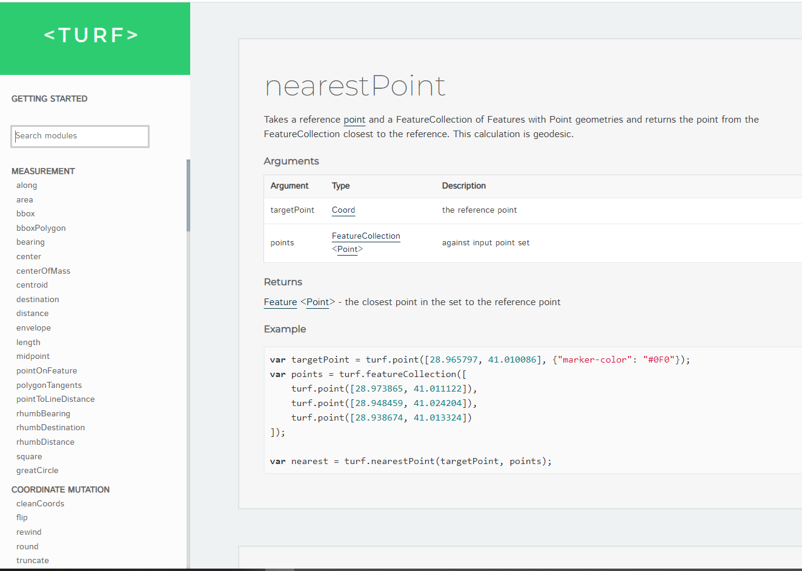

 
       
#### Web
* [https://turfjs.org/](https://turfjs.org/){target=_blank}





### Documentación
* [https://github.com/Turfjs/turf/](https://github.com/Turfjs/turf/){target=_blank} 

### Descripción 

Turf.js es una biblioteca de análisis y procesamiento de geodatos escrita en JavaScript. Proporciona una serie de herramientas y funciones para realizar análisis espaciales y geométricos en datos geográficos, como puntos, líneas y polígonos.

Turf.js proporciona una amplia variedad de funciones para realizar análisis y procesamiento de geodatos. Algunas de las funciones más comunes incluyen:

* turf.distance: calcula la distancia entre dos puntos en un mapa.
* turf.bearing: calcula la dirección en grados entre dos puntos en un mapa.
* turf.center: encuentra el centro de un conjunto de puntos o un polígono.
* turf.area: calcula la superficie de un polígono.
* turf.length: calcula la longitud de una línea o el perímetro de un polígono.
* turf.nearestPoint: encuentra el punto más cercano a otro punto en un conjunto de puntos.
* turf.buffer: crea un área circular alrededor de un punto dado.
* turf.convex: calcula el polígono convexo más pequeño que contiene un conjunto de puntos.
* turf.intersect: determina si dos polígonos o líneas se intersectan.
     

Utilza GeoJson para encapsular las geometrias

###  ¿Cómo empezar?

Para trabajar con **Turf.js** tendremos llamar a la libreria de esta forma

<script src="https://cdn.jsdelivr.net/npm/@turf/turf@6.5.0/turf.min.js"></script>

### Ejemplo de uso en turf, turf.nearest

La función turf.nearest toma dos argumentos: un punto de referencia y un conjunto de puntos. Devuelve el punto más cercano del conjunto de puntos al punto de referencia.

Aquí hay un ejemplo de cómo obtener los cinco puntos más cercanos a un punto de referencia:

```javascript
const point = turf.point([-80.6635, 35.0539]);
const points = turf.points([[-80.6635, 35.0539],
  [-80.6650, 35.0529],
  [-80.6650, 35.0550],
  [-80.6640, 35.0562],
  [-80.6635, 35.0580],
  [-80.6630, 35.0595],
  [-80.6620, 35.0510]
]);

const nearestPoints = points.features.slice(0, 5).map(point => turf.nearest(point, points));
console.log(nearestPoints);

```
En este ejemplo, se usa slice para obtener los primeros cinco elementos del conjunto de puntos y luego se usa map para aplicar turf.nearest a cada uno de ellos. Esto devuelve una matriz de los cinco puntos más cercanos al punto de referencia    

