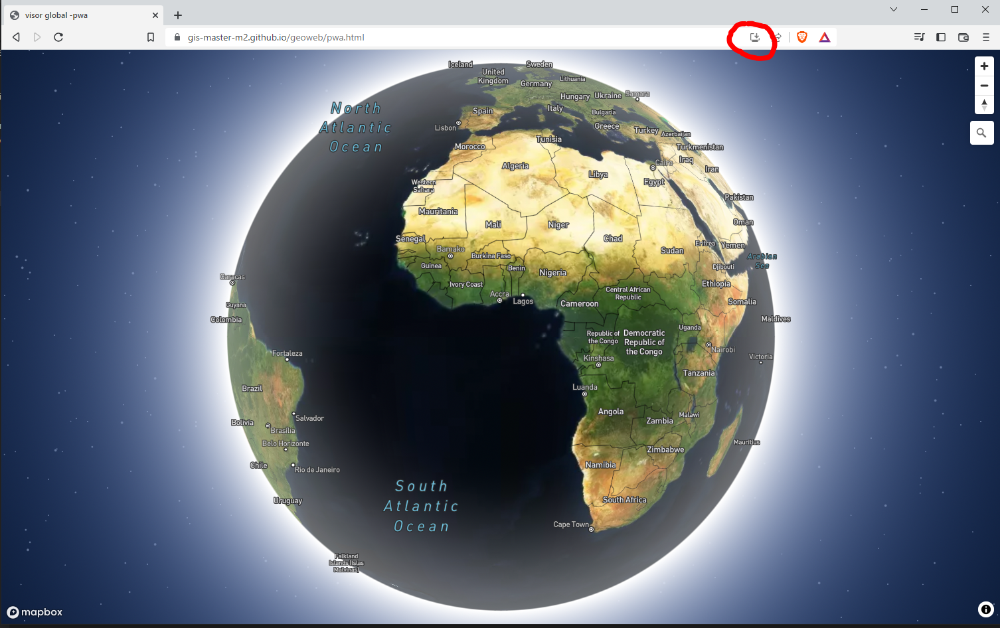
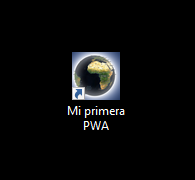
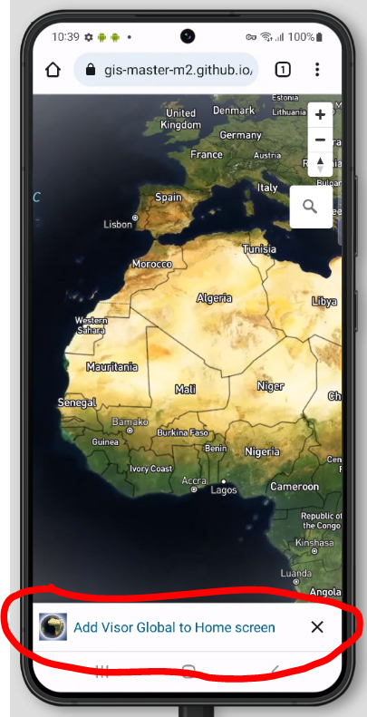

Vamos a crear nuestra primer PWA a partir del visor globe que hemos hecho en el punto 3.2 
 


#### Paso 1- Creamos el archivo "pwa.html" dentro de "/geoweb"

 * Copiamos el código del archivo "mapbox-global.html"

```html hl_lines="3"
<html lang="es">
  <head>
  <title>visor global -pwa</title>
    <meta charset="utf-8" />
    <meta name="viewport" content="width=device-width, initial-scale=1.0">
    <meta name="author" content="autor"/>
    <meta name="description" content="descripción página">
    <meta name="robots" content="index,follow">
    <link rel="stylesheet" href="https://api.mapbox.com/mapbox-gl-js/v2.11.0/mapbox-gl.css" />
    <script src="https://api.mapbox.com/mapbox-gl-js/v2.11.0/mapbox-gl.js"></script>

    <script src="https://api.mapbox.com/mapbox-gl-js/plugins/mapbox-gl-geocoder/v5.0.0/mapbox-gl-geocoder.min.js"></script>
    <link rel="stylesheet" href="https://api.mapbox.com/mapbox-gl-js/plugins/mapbox-gl-geocoder/v5.0.0/mapbox-gl-geocoder.css" type="text/css">
  <style>
  body {
    margin: 0;
    padding: 0;
    overflow: hidden;
  }
  #map {
    height: 100%;
    width: 100%;
  }
  </style>
  <script>
var map;  // tambien const map;
  function init() {
            mapboxgl.accessToken =
                'pk.eyJ1IjoiZ2lzbWFzdGVybTIiLCJhIjoiY2plZHhubTQxMTNoYzMza3Rqa3kxYTdrOCJ9.53B1E6mKD_EQOVb2Y0-SsA';
            map = new mapboxgl.Map({
                container: 'map',
                style: 'mapbox://styles/mapbox/satellite-streets-v11',
                center: [0, 0],
                zoom: 2.3,
                projection:'globe',
                attributionControl: false
            });
        map.addControl(new mapboxgl.AttributionControl({compact: true}));
        map.addControl(new mapboxgl.NavigationControl());
        map.on('load', () => {
            map.setFog({}); 
        });


                map.addControl(
                    new MapboxGeocoder({
                    accessToken: mapboxgl.accessToken,
                    mapboxgl: mapboxgl,
                    collapsed:true
                    })
                 );

        }
  </script>
  </head>
  <body onLoad="init()">
  <div id="map"></div>
  </body>
  </html>

```

#### Paso 2- Creamos el archivo "manifest-pwa.json" dentro de "/geoweb"

```JSON
{
    "name": "Mi primera PWA",
    "short_name": "Visor Global",
    "theme_color": "#2196f3",
    "background_color": "#2196f3",
    "display": "standalone",
    "scope": "/geoweb/",
    "start_url": "/geoweb/",
    "icons": [
  
      {
        "src": "images/capture_128.png",
        "sizes": "128x128",
        "type": "image/png"
      }, 
      {
        "src": "images/capture_256.png",
        "sizes": "256x256",
        "type": "image/png"
      },
      {
        "src": "images/capture_512.png",
        "sizes": "512x512",
        "type": "image/png"  
      }
 
    ]
  
  }
  
```

!!! tip "También podemos utilzar esta web para generar archivos manifest"
    [https://app-manifest.firebaseapp.com/](https://app-manifest.firebaseapp.com/){target=_blank}


#### Paso 3- Creamos el archivo "serviceworker.js" dentro del directorio  "/geoweb"

!!! tip "Este archivo solo hace falta crearlo una vez y nos servirá siempre"


```JavaScript

'use strict';

const CACHE_NAME = 'static-cache-v1';

const FILES_TO_CACHE = [
  'offline.html',
];
self.addEventListener('install', (evt) => {

  evt.waitUntil(
      caches.open(CACHE_NAME).then((cache) => {
 
        return cache.addAll(FILES_TO_CACHE);
      })
  );
  self.skipWaiting();
});
self.addEventListener('activate', (evt) => {

  evt.waitUntil(
      caches.keys().then((keyList) => {
        return Promise.all(keyList.map((key) => {
          if (key !== CACHE_NAME) {
            return caches.delete(key);
          }
        }));
      }) 
  );
  self.clients.claim();
});
self.addEventListener('fetch', (evt) => {

  if (evt.request.mode !== 'navigate') {
  
    return;
  }
  evt.respondWith(
      fetch(evt.request)
          .catch(() => {
            return caches.open(CACHE_NAME)
                .then((cache) => {
                  return cache.match('offline.html');
                });
          })
  );
});


```

#### Paso 4- Creamos el archivo "offline.html" dentro del directorio JS de  "/geoweb"

!!! tip "Este archivo solo hace falta crearlo una vez y nos servirá siempre"
        Es un archivo html vacio dón el service worker creará un "copia" offline de nuestro visor


```html
<html>
 <head>
 <head>
 <body>
 <body>            
<html>    

```


#### Paso 5- Añadimos manifest, serviceworker y otros <meta> a nuestro visor pwa.html


```html hl_lines="15 61-69"
<html lang="es">
  <head>
  <title>visor global -pwa</title>
    <meta charset="utf-8" />
    <meta name="viewport" content="width=device-width, initial-scale=1.0">
    <meta name="author" content="autor"/>
    <meta name="description" content="descripción página">
    <meta name="robots" content="index,follow">
    <link rel="stylesheet" href="https://api.mapbox.com/mapbox-gl-js/v2.11.0/mapbox-gl.css" />
    <script src="https://api.mapbox.com/mapbox-gl-js/v2.11.0/mapbox-gl.js"></script>

    <script src="https://api.mapbox.com/mapbox-gl-js/plugins/mapbox-gl-geocoder/v5.0.0/mapbox-gl-geocoder.min.js"></script>
    <link rel="stylesheet" href="https://api.mapbox.com/mapbox-gl-js/plugins/mapbox-gl-geocoder/v5.0.0/mapbox-gl-geocoder.css" type="text/css">

    <link id="manifest"  rel="manifest" href="manifest-pwa.json">


  <style>
  body {
    margin: 0;
    padding: 0;
    overflow: hidden;
  }
  #map {
    height: 100%;
    width: 100%;
  }
  </style>
  <script>
var map;  // tambien const map;
  function init() {
            mapboxgl.accessToken =
                'pk.eyJ1IjoiZ2lzbWFzdGVybTIiLCJhIjoiY2plZHhubTQxMTNoYzMza3Rqa3kxYTdrOCJ9.53B1E6mKD_EQOVb2Y0-SsA';
            map = new mapboxgl.Map({
                container: 'map',
                style: 'mapbox://styles/mapbox/satellite-streets-v11',
                center: [0, 0],
                zoom: 2.3,
                projection:'globe',
                attributionControl: false
            });
        map.addControl(new mapboxgl.AttributionControl({compact: true}));
        map.addControl(new mapboxgl.NavigationControl());
        map.on('load', () => {
            map.setFog({}); 
        });


                map.addControl(
                    new MapboxGeocoder({
                    accessToken: mapboxgl.accessToken,
                    mapboxgl: mapboxgl,
                    collapsed:true
                    })
                 );

        }
  </script>


   <script>
       if ('serviceWorker' in navigator) {
			navigator.serviceWorker
				.register('./serviceworker.js')
				.then(function() {
					console.log("SW Registered");
				})
		}
  </script>


  </head>
  <body onLoad="init()">
  <div id="map"></div>
  </body>
  </html>

```


#### Paso 6- Visualizar PWA en HTTPS

Para poder hacer una instalación correcta de la PWA necesitamos que este en HTTPS, debemos subirla a Github y ver via web de githab

```
https://{tu_usuario_github}.github.io/geoweb/pwa.html

```

!!! success "Subimos el ejemplo al GitHub"
	
	```bash

		git pull
        git add .
        git commit -m "pwa"
        git push

	```


!!! tip "Si aparece la icona de instalación en la barra de navegación de del browser todo está ok!!"  


 


Una vez instalada aparecerá una icona en el desktop





!!! question "¿Probamos de visualizar en un móbil? ¿Qué pasa?"




### Practica

!!! summary "Probamos de convertir cualquier otro visor a PWA"