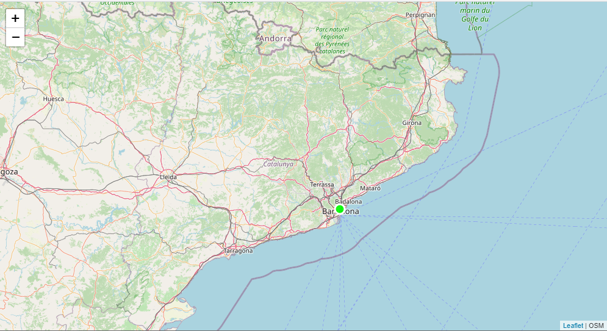

       

## 4. Introduccion a Leaflet

 >Leaflet es una librería JavaScript opensource utilizada por Flickr, Wikimedia, foursquare, OSM, carto, GIS Cloud, Washington Post, Wall Street Journal, Geocaching.com, etc. Puntos fuertes de la API de Leaflet son:
      
  *  Facilidad para aprender y usar
  *  Soporte móvil
  *  HTML 5, CSS3 y pasarela WebGL
  *  Funciona tanto en los modernos como en los viejos navegadores web
  *  Muchos plugins
  *  API bien documentada  
 
## Recursos Leaflet JS

#### Web
* [http://leafletjs.com/](http://leafletjs.com/){target=_blank}

#### API
 *  [http://leafletjs.com/reference.html](http://leafletjs.com/reference.html){target=_blank}

#### Plugins
 *  [http://leafletjs.com/plugins.html](http://leafletjs.com/plugins.html){target=_blank}

#### Definición
 *  [https://en.wikipedia.org/wiki/Leaflet_(software)](https://en.wikipedia.org/wiki/Leaflet_(software)){target=_blank}

#### Tutoriales
 *  [http://www.digital-geography.com/category/leaflet-js/](http://www.digital-geography.com/category/leaflet-js/){target=_blank}
 *  [http://leafletjs.com/examples.html](http://leafletjs.com/examples.html){target=_blank}
 *  [http://maptimeboston.github.io/leaflet-intro/](http://maptimeboston.github.io/leaflet-intro/){target=_blank}
 *  [http://asmaloney.com/2014/01/code/creating-an-interactive-map-with-leaflet-andopenstreetmap/](http://asmaloney.com/2014/01/code/creating-an-interactive-map-with-leaflet-andopenstreetmap/){target=_blank}
 *  [http://mappinggis.com/2013/06/como-crear-un-mapa-con-leaflet/](http://mappinggis.com/2013/06/como-crear-un-mapa-con-leaflet/){target=_blank}

#### Videos
*  [https://www.youtube.com/watch?v=7Tll2k57ork](https://www.youtube.com/watch?v=7Tll2k57ork){target=_blank}
* [https://egghead.io/lessons/javascript-get-started-with-leafletjs-mapping](https://egghead.io/lessons/javascript-get-started-with-leafletjs-mapping){target=_blank}
* [https://www.youtube.com/watch?v=1VYvjHb6KeM](https://www.youtube.com/watch?v=1VYvjHb6KeM){target=_blank}
* [https://www.youtube.com/watch?v=TseoObyFg8E](https://www.youtube.com/watch?v=TseoObyFg8E){target=_blank}

     

 
####  ¿Cómo empezar?

> Ver videos 5 y 6

> Descargamos [geoweb.zip](datos/geoweb.zip) y descomprimir dentro de nuestro directorio **geoweb** del servidor web 


En VSCODE  creamos la página **leaflet-basico.html** dentro directorio geoweb

Añadiremos el siguiente código que es la estructura básica de una página :

```html

  <html lang="es">
  <head>
  <title>Leaflet básico</title>
    <meta charset="utf-8" />
    <meta name="viewport" content="width=device-width, initial-scale=1.0">
    <meta name="author" content="autor"/>
    <meta name="description" content="descripción página">
    <meta name="robots" content="index,follow">
  </head>
  <body>
  </body>
  </html>
```
Vamos a crear un mapa con Leaflet, para ello incluiremos en la cabecera
  `<head>` de una página web la librería JavaScript leaflet.js (que contiene el código de la libería)
  y la hoja de estilo leaflet.css (con la hoja de estilos de la librería):
  
```html  hl_lines="1 2"
      <link rel="stylesheet" href="https://unpkg.com/leaflet@1.7.1/dist/leaflet.css" />
      <script src="https://unpkg.com/leaflet@1.7.1/dist/leaflet.js"></script>
``` 

Dentro de la etiqueta `<body>` encontramos el marcado para el mapa, que genera un único elemento de documento. También damos al contenedor un atributo id para que podamos hacer referencia a él en nuestro código:

```html
<body>
<div id="map"></div>
</body>
```

Nuestra página tendria este aspecto

```html
<html lang="es">
<head>
<title>Leaflet básico</title>
  <meta charset="utf-8" />
  <meta name="viewport" content="width=device-width, initial-scale=1.0">
  <meta name="author" content="autor"/>
  <meta name="description" content="descripción página">
  <meta name="robots" content="index,follow">
  <link rel="stylesheet" href="https://unpkg.com/leaflet@1.7.1/dist/leaflet.css" />
  <script src="https://unpkg.com/leaflet@1.7.1/dist/leaflet.js"></script>
</head>
<body>
<div id="map"></div>
</body>
</html>
``` 
Añadiremos un estilo al mapa para que ocupe toda la página web, dentro la etiqueta ``` <style/>``` dentro del ```<head>```

```html
<style>
  body {
    margin: 0;
    padding: 0;
    overflow: hidden;
  }
  #map {
    height: 100%;
    width: 100%;
  }
 </style>
``` 
 


Ahora nuestra página tendria este aspecto

```html 
<html lang="es">
<head>
<title>Leaflet básico</title>
  <meta charset="utf-8" />
  <meta name="viewport" content="width=device-width, initial-scale=1.0">
  <meta name="author" content="autor"/>
  <meta name="description" content="descripción página">
  <meta name="robots" content="index,follow">
  <link rel="stylesheet" href="https://unpkg.com/leaflet@1.7.1/dist/leaflet.css" />
  <script src="https://unpkg.com/leaflet@1.7.1/dist/leaflet.js"></script>
  <style>
  body {
    margin: 0;
    padding: 0;
    overflow: hidden;
  }
  #map {
    height: 100%;
    width: 100%;
  }
 </style>
</head>
<body>
<div id="map"></div>
</body>
</html>
``` 

Ahora crearemos y empezaremos a programar dentro del tag ``` <script> ```  justo encima de ```</head>```
   Crearemos la función **Init** para crear un Mapa
  y añadir una capa de OSM **L.map** es la clase central de la API.
   Se usa para crear y manipular el mapa. 
   El mapa por defecto tiene dos controles: uno de zoom y uno de atribución.

!!! summary "L.map"
   
    #### **L.map** 
    Es el constructor principal de Leaflet

    Propiedades: <a target="_blank"  rel="noopener"  href="https://leafletjs.com/reference-1.7.1.html#map-factory">https://leafletjs.com/reference-1.7.1.html#map-factory</a>

    Métodos: [https://leafletjs.com/reference-1.7.1.html#map-methods-for-modifying-map-state](https://leafletjs.com/reference-1.7.1.html#map-methods-for-modifying-map-state ){target=_blank}

    Eventos: <a target="_blank"  rel="noopener"  href="https://leafletjs.com/reference-1.7.1.html#map-event">https://leafletjs.com/reference-1.7.1.html#map-event</a>


!!! summary "L.tileLayer"
    #### **L.tileLayer**
    Es un tipo de capa raster que se añade al objeto L.map

    Referencia: <a target="_blank"  rel="noopener"  href="https://leafletjs.com/reference-1.7.1.html#tilelayer">https://leafletjs.com/reference-1.7.1.html#tilelayer</a>

   


```html
 <script>
  var map,capa1;
  function init(){
      map = L.map("map",{
      center:[41.6863, 1.8382],
      zoom:8
      });
      capa1= L.tileLayer("http://{s}.tile.openstreetmap.org/{z}/{x}/{y}.png",
      {
      maxZoom : 19,
      minZoom : 1,
      attribution : "OSM"
      });
      capa1.addTo(map);
  }
  </script>
```

Llamaremos a la función desde el evento onload del ```<body>```

```html
 <body onLoad="init()">
```


### **Leaflet básico final**
```html
  <html lang="es">
  <head>
  <title>Leaflet básico</title>
    <meta charset="utf-8" />
    <meta name="viewport" content="width=device-width, initial-scale=1.0">
    <meta name="author" content="autor"/>
    <meta name="description" content="descripción página">
    <meta name="robots" content="index,follow">
    <link rel="stylesheet" href="https://unpkg.com/leaflet@1.7.1/dist/leaflet.css" />
    <script src="https://unpkg.com/leaflet@1.7.1/dist/leaflet.js"></script>
  <style>
  body {
    margin: 0;
    padding: 0;
    overflow: hidden;
  }
  #map {
    height: 100%;
    width: 100%;
  }
  </style>
  <script>
  var map,capa1;
  function init(){
      map = L.map("map",{
      center:[41.6863, 1.8382],
      zoom:8
      });
      capa1= L.tileLayer("http://{s}.tile.openstreetmap.org/{z}/{x}/{y}.png",
      {
      maxZoom : 19,
      minZoom : 1,
      attribution : "OSM"
      });
      capa1.addTo(map);
  }
  </script>
  </head>
  <body onLoad="init()">
  <div id="map"></div>
  </body>
  </html>
```
       
¿Que acabamos de hacer? Miramos dentro del tag ``` <script> ```


 * Hemos creado la variable global **map**
 * Usamos **L.map()** para instanciar el objeto mapa, pasando el id del ```<div>``` dónde irá el mapa
 * Utilizamos las opciones center y zoom iniciar el mapa También podríamos utilizar el método
 **setView **

```
 map =L.map('map').setView([41.6863, 1.8382], 8);)
```

 *  Usamos **L.tileLayer()** para crear una capa base en un servidor OSM de tiles. {z}/{x}/{y}. También pasamos algunas opciones Attribution : atribución de la capa maxZoom y minZoom :niveles de zoom.
 * Usamos método **addTo()** para añadir la capa al mapa


!!! tip "Si quisieramos añadir un punto al mapa"
	
	```javascript
		L.marker([41.3954, 2.16859]).addTo(map);
		
	```

!!! tip "Si quisieramos añadir un popup al punto"
	
	```javascript
		L.marker([41.3954, 2.16859]).addTo(map).bindPopup('Hola punto');
	```    

!!! tip "Si quisieramos que el popup estuviera abierto por defecto"
	
	```javascript
		L.marker([41.3954, 2.16859]).addTo(map).bindPopup('Hola punto').openPopup();
	```  

!!! tip "Lo mismo pero programando diferente"
	
	```javascript
	var punto = L.marker([41.3954, 2.16859]);
        punto.addTo(map);
        punto.bindPopup('Hola punto');
        punto.openPopup();
	```      

!!! tip "Si quiero añadir un punto de tipo círculo, con opciones (vector)"
	
	```javascript
	var punto = L.circleMarker([41.3954, 2.16859],{
                color: '#ffffff',
                fillColor: '#00ff00',
                fillOpacity: 0.9,
                radius: 8
                 });
        punto.addTo(map);
        punto.bindPopup('Hola punto');
        punto.openPopup();
	```  

!!! tip "Si quisieramos añadir un punto con estilo al hacer clic en el mapa(Evento)"

	```javascript
		  map.on('click', function (e) {
            new L.circleMarker(e.latlng, {
                color: '#ffffff',
                fillColor: '#00ff00',
                fillOpacity: 0.9,
                radius: 8
            }).addTo(map)
                .bindPopup(e.latlng.lat + "," + e.latlng.lng)
                .openPopup();
         });
	```



!!! success "Visualizamos , editamos index.html y subimos el ejemplo al GitHub"
	

	```bash

		git pull
        git add .
        git commit -m "primer ejemplo leaflet"
        git push

	```


#### **Ejemplo 1 Controles**
  Añadimos controles de capas y escala.

* Creamos la página **leaflet-controles.html** dentro directorio geoweb

!!! abstract "L.control.layers"
    #### **L.control.layers**
    Es un control que nos permite activar y desactivar capas base (baseLayers) y "overlays"

    **baseLayers**: són capas de referéncia y sólo puede haber una activa

    **overlays**:són capas que aparcen encima de las de referéncia (baseLayers) y puede haber una o varias activas

    Referencia: <a target="_blank"  rel="noopener"  href="https://leafletjs.com/reference-1.7.1.html#control-layers">https://leafletjs.com/reference-1.7.1.html#control-layers</a>

    #### **L.control.scale**
    Es un control añade un escala gráfica del mapa

    Referencia: <a target="_blank"  rel="noopener"  href="https://leafletjs.com/reference-1.7.1.html#control-scale">https://leafletjs.com/reference-1.7.1.html#control-scale</a>


#### Copiamos y pegamos código

```html
  <html lang="es">
<head>
    <title>Ejemplo 1 Leaflet-controles</title>
    <meta charset="utf-8" />
    <meta name="viewport" content="width=device-width, initial-scale=1.0" />
    <meta name="author" content="autor" />
    <meta name="description" content="descripción página" />
    <meta name="robots" content="index,follow" />
    <link rel="stylesheet" href="https://unpkg.com/leaflet@1.7.1/dist/leaflet.css" />
    <script src="https://unpkg.com/leaflet@1.7.1/dist/leaflet.js"></script>
    <style>
        body {
            margin: 0;
            padding: 0;
            overflow: hidden;
        }

        #map {
            height: 100%;
            width: 100%;
        }
    </style>
    
    <script>
        var map, osm, esri, terreno;
        var controlCapas;
        var controlEscala;

        function init() {
            map = L.map('map').setView([41.6863, 1.8382], 8);

            esri = L.tileLayer(
                'http://server.arcgisonline.com/ArcGIS/rest/services/World_Imagery/MapServer/tile/{z}/{y}/{x}', {
                maxZoom: 17,
                minZoom: 1,
                attribution: 'Tiles © Esri',
            }).addTo(map);

            osm = L.tileLayer('http://{s}.tile.openstreetmap.org/{z}/{x}/{y}.png', {
                maxZoom: 19,
                minZoom: 1,
                attribution: 'OSM'
            });

            terreno =
                L.tileLayer('http://{s}.tile.stamen.com/terrain-background/{z}/{x}/{y}.png', {
                    maxZoom: 19,
                    attribution: 'Stamen terrain',
                    opacity: 0.5
                });
            var baseMaps = {
                "Orto_esri": esri,
                "Mapa_osm": osm
            };
            var overlayMaps = {
                "Terrain": terreno
            };

            controlCapas = L.control.layers(baseMaps, overlayMaps);
            controlCapas.addTo(map);

            controlEscala = L.control.scale();
            controlEscala.addTo(map);
        }
    </script>
</head>

<body onLoad="init()">
<div id="map">
    </div>
    </body>

</html>

```


!!! question "Pregunta" 
	<h4>¿Como lo haríamos para ver el control de capas abierto por defecto?</h4>
    Respuesta:Miramos opciones del control-layers

    ``` 
    controlCapas = L.control.layers(baseMaps, overlayMaps,{collapsed:false}); 
    ```


### BaseLayer y Overlays


| tipo     | Description                          |
| ----------- | ------------------------------------ |
| BaseLayer       | són capas de referéncia (fondo) y sólo puede haber una activa (Ejemplo:Fondo satélite) |
| Overlay       | són capas que aparcen encima de las de referéncia (baseLayers) y puede haber una o varias activas (Ejemplo:Capa puntos) |

> ¿Que mapas de fondo puedo añadir?
>Existem muchas fuentes que ofrecen fondos de referencia que podemos utilizar en Leaflet

>Algunas de ellas nos piden un previo registro y accestoken que podemos añadir a la url de servicio

!!! tip "Miramos los ejemplos de fondos de esta web"

  [https://leaflet-extras.github.io/leaflet-providers/preview/](https://leaflet-extras.github.io/leaflet-providers/preview/){target=_blank} 

#### **Ejemplo 2 Provider**

* Creamos la página **leaflet-provider.html** dentro directorio geoweb
* Copiamos pegamos código

```html
  
<html lang="es">

    <head>
        <title>Ejemplo Leaflet provider</title>
        <meta charset="utf-8" />
        <meta name="viewport" content="width=device-width, initial-scale=1.0" />
        <meta name="author" content="autor" />
        <meta name="description" content="descripción página" />
        <meta name="robots" content="index,follow" />
        <link rel="stylesheet" href="https://unpkg.com/leaflet@1.7.1/dist/leaflet.css" />
        <style>
            body {
                margin: 0;
            }
    
            #map {
                height: 100%;
                width: 100%;
                background-color: #ffffff
            }
        </style>
        <script src="https://unpkg.com/leaflet@1.7.1/dist/leaflet.js"></script>
        <script>
            var map, osm, controlCapas;
    
            function init() {
                map = L.map('map', {
                    center: [39.6863, 2.8382],
                    zoom: 8
                });
                osm = L.tileLayer('https://{s}.tile.openstreetmap.org/{z}/{x}/{y}.png', {
                    maxZoom: 19,
                    minZoom: 1,
                    attribution: '&copy; <a href="http://www.openstreetmap.org/copyright"/>OpenStreetMap</a>'
                }).addTo(map);
    
                var OpenStreetMap_DE =
                    L.tileLayer('http://{s}.tile.openstreetmap.de/tiles/osmde/{z}/{x}/{y}.png', {
                        attribution: '&copy; <a href="http://www.openstreetmap.org/copyright"/>OpenStreetMap</a>'
                    });
                var OpenStreetMap_HOT = L.tileLayer('http://{s}.tile.openstreetmap.fr/hot/{z}/{x}/{y}.png', {
                    attribution: '&copy; <a href="http://www.openstreetmap.org/copyright"/>OpenStreetMap</a>, Tiles courtesy of <a href="http://hot.openstreetmap.org/" target="_blank"/>Humanitarian OpenStreetMapTeam</a>'
                });
    
                var Stamen_Toner = L.tileLayer('http://{s}.tile.stamen.com/toner/{z}/{x}/{y}.png', {
                    attribution: 'Map tiles by <a href="http://stamen.com"/>Stamen Design</a>, <a href="http://creativecommons.org/licenses/by/3.0"/>CC BY 3.0</a> &mdash; Map data &copy;<a href="http://www.openstreetmap.org/copyright"/>OpenStreetMap</a>',
                    subdomains: 'abcd',
                    minZoom: 0,
                    maxZoom: 20
                });
                var Stamen_Watercolor = L.tileLayer('http://{s}.tile.stamen.com/watercolor/{z}/{x}/{y}.png', {
                    attribution: 'Map tiles by <a href="http://stamen.com"/>Stamen Design</a>, <a href="http://creativecommons.org/licenses/by/3.0"/>CC BY 3.0</a> &mdash; Map data &copy; <a href="http://www.openstreetmap.org/copyright"/>OpenStreetMap</a>',
                    subdomains: 'abcd',
                    minZoom: 1,
                    maxZoom: 16
                });
                var Esri_WorldStreetMap =
                    L.tileLayer(
                        'http://server.arcgisonline.com/ArcGIS/rest/services/World_Street_Map/MapServer/tile/{z}/{y}/{x}', {
                            attribution: 'Tiles &copy; Esri &mdash; Source: Esri, DeLorme, NAVTEQ, USGS,Intermap, iPC, NRCAN, Esri Japan, METI, Esri China (Hong Kong), Esri (Thailand), TomTom,2012'
                        });
    
                var Esri_WorldTopoMap =
                    L.tileLayer(
                        'http://server.arcgisonline.com/ArcGIS/rest/services/World_Topo_Map/MapServer/tile/{z}/{y}/{x}', {
                            attribution: 'Tiles &copy; Esri &mdash; Esri, DeLorme, NAVTEQ, TomTom, Intermap,iPC, USGS, FAO, NPS, NRCAN, GeoBase, Kadaster NL, Ordnance Survey, Esri Japan, METI, EsriChina (Hong Kong), and the GIS User Community'
                        });
                var Esri_WorldImagery =
                    L.tileLayer(
                        'http://server.arcgisonline.com/ArcGIS/rest/services/World_Imagery/MapServer/tile/{z}/{y}/{x}', {
                            attribution: 'Tiles &copy; Esri &mdash; Source: Esri, i-cubed, USDA, USGS, AEX,GeoEye, Getmapping, Aerogrid, IGN, IGP, UPR-EGP, and the GIS User Community'
                        });
                var Esri_WorldShadedRelief =
                    L.tileLayer(
                        'http://server.arcgisonline.com/ArcGIS/rest/services/World_Shaded_Relief/MapServer/tile/{z}/{y}/{x}', {
                            attribution: 'Tiles &copy; Esri &mdash; Source: Esri',
                            maxZoom: 13
                        });
                var Esri_OceanBasemap =
                    L.tileLayer(
                        'http://server.arcgisonline.com/ArcGIS/rest/services/Ocean_Basemap/MapServer/tile/{z}/{y}/{x}', {
                            attribution: 'Tiles &copy; Esri &mdash; Sources: GEBCO, NOAA, CHS, OSU, UNH,CSUMB, National Geographic, DeLorme, NAVTEQ, and Esri',
                            maxZoom: 13
                        });
    
    
    
                var mapaBase = {
                    'OSM': osm,
                    'OpenStreetMap_DE': OpenStreetMap_DE,
                    'OpenStreetMap_HOT': OpenStreetMap_HOT,
                    'Stamen_Toner': Stamen_Toner,
                    'Stamen_Watercolor': Stamen_Watercolor,
                    'Esri_WorldStreetMap': Esri_WorldStreetMap,
                    'Esri_WorldTopoMap': Esri_WorldTopoMap,
                    'Esri_WorldImagery': Esri_WorldImagery,
                    'Esri_WorldShadedRelief': Esri_WorldShadedRelief,
                    'Esri_OceanBasemap': Esri_OceanBasemap
                };
                controlCapas = L.control.layers(mapaBase, null);
                controlCapas.addTo(map);
                controlEscala = L.control.scale();
                controlEscala.addTo(map);
            }
        </script>
    </head>
    
    <body onLoad="init()">
        <div id="map"> </div>
    </body>
    
    </html>
```
* Visualizamos mapa

!!! question "Pregunta"

    <h3>¿Cómo añadiriamos una capa de tipo "overlay"?</h3>
 

*Solución

```html hl_lines="101-107"
<html lang="es">

<head>
    <title>Ejemplo Leaflet provider</title>
    <meta charset="utf-8" />
    <meta name="viewport" content="width=device-width, initial-scale=1.0" />
    <meta name="author" content="autor" />
    <meta name="description" content="descripción página" />
    <meta name="robots" content="index,follow" />
    <link rel="stylesheet" href="https://unpkg.com/leaflet@1.7.1/dist/leaflet.css" />
    <style>
        body {
            margin: 0;
        }

        #map {
            height: 100%;
            width: 100%;
            background-color: #ffffff
        }
    </style>
    <script src="https://unpkg.com/leaflet@1.7.1/dist/leaflet.js"></script>
    <script>
        var map, osm, controlCapas;

        function init() {
            map = L.map('map', {
                center: [39.6863, 2.8382],
                zoom: 8
            });
            osm = L.tileLayer('https://{s}.tile.openstreetmap.org/{z}/{x}/{y}.png', {
                maxZoom: 19,
                minZoom: 1,
                attribution: '&copy; <a href="http://www.openstreetmap.org/copyright"/>OpenStreetMap</a>'
            }).addTo(map);

            var OpenStreetMap_DE =
                L.tileLayer('http://{s}.tile.openstreetmap.de/tiles/osmde/{z}/{x}/{y}.png', {
                    attribution: '&copy; <a href="http://www.openstreetmap.org/copyright"/>OpenStreetMap</a>'
                });
            var OpenStreetMap_HOT = L.tileLayer('http://{s}.tile.openstreetmap.fr/hot/{z}/{x}/{y}.png', {
                attribution: '&copy; <a href="http://www.openstreetmap.org/copyright"/>OpenStreetMap</a>, Tiles courtesy of <a href="http://hot.openstreetmap.org/" target="_blank"/>Humanitarian OpenStreetMapTeam</a>'
            });

            var Stamen_Toner = L.tileLayer('http://{s}.tile.stamen.com/toner/{z}/{x}/{y}.png', {
                attribution: 'Map tiles by <a href="http://stamen.com"/>Stamen Design</a>, <a href="http://creativecommons.org/licenses/by/3.0"/>CC BY 3.0</a> &mdash; Map data &copy;<a href="http://www.openstreetmap.org/copyright"/>OpenStreetMap</a>',
                subdomains: 'abcd',
                minZoom: 0,
                maxZoom: 20
            });
            var Stamen_Watercolor = L.tileLayer('http://{s}.tile.stamen.com/watercolor/{z}/{x}/{y}.png', {
                attribution: 'Map tiles by <a href="http://stamen.com"/>Stamen Design</a>, <a href="http://creativecommons.org/licenses/by/3.0"/>CC BY 3.0</a> &mdash; Map data &copy; <a href="http://www.openstreetmap.org/copyright"/>OpenStreetMap</a>',
                subdomains: 'abcd',
                minZoom: 1,
                maxZoom: 16
            });
            var Esri_WorldStreetMap =
                L.tileLayer(
                    'http://server.arcgisonline.com/ArcGIS/rest/services/World_Street_Map/MapServer/tile/{z}/{y}/{x}', {
                        attribution: 'Tiles &copy; Esri &mdash; Source: Esri, DeLorme, NAVTEQ, USGS,Intermap, iPC, NRCAN, Esri Japan, METI, Esri China (Hong Kong), Esri (Thailand), TomTom,2012'
                    });

            var Esri_WorldTopoMap =
                L.tileLayer(
                    'http://server.arcgisonline.com/ArcGIS/rest/services/World_Topo_Map/MapServer/tile/{z}/{y}/{x}', {
                        attribution: 'Tiles &copy; Esri &mdash; Esri, DeLorme, NAVTEQ, TomTom, Intermap,iPC, USGS, FAO, NPS, NRCAN, GeoBase, Kadaster NL, Ordnance Survey, Esri Japan, METI, EsriChina (Hong Kong), and the GIS User Community'
                    });
            var Esri_WorldImagery =
                L.tileLayer(
                    'http://server.arcgisonline.com/ArcGIS/rest/services/World_Imagery/MapServer/tile/{z}/{y}/{x}', {
                        attribution: 'Tiles &copy; Esri &mdash; Source: Esri, i-cubed, USDA, USGS, AEX,GeoEye, Getmapping, Aerogrid, IGN, IGP, UPR-EGP, and the GIS User Community'
                    });
            var Esri_WorldShadedRelief =
                L.tileLayer(
                    'http://server.arcgisonline.com/ArcGIS/rest/services/World_Shaded_Relief/MapServer/tile/{z}/{y}/{x}', {
                        attribution: 'Tiles &copy; Esri &mdash; Source: Esri',
                        maxZoom: 13
                    });
            var Esri_OceanBasemap =
                L.tileLayer(
                    'http://server.arcgisonline.com/ArcGIS/rest/services/Ocean_Basemap/MapServer/tile/{z}/{y}/{x}', {
                        attribution: 'Tiles &copy; Esri &mdash; Sources: GEBCO, NOAA, CHS, OSU, UNH,CSUMB, National Geographic, DeLorme, NAVTEQ, and Esri',
                        maxZoom: 13
                    });


            var mapaBase = {
                'OSM': osm,
                'OpenStreetMap_DE': OpenStreetMap_DE,
                'OpenStreetMap_HOT': OpenStreetMap_HOT,
                'Stamen_Toner': Stamen_Toner,
                'Stamen_Watercolor': Stamen_Watercolor,
                'Esri_WorldStreetMap': Esri_WorldStreetMap,
                'Esri_WorldTopoMap': Esri_WorldTopoMap,
                'Esri_WorldImagery': Esri_WorldImagery,
                'Esri_WorldShadedRelief': Esri_WorldShadedRelief,
                'Esri_OceanBasemap': Esri_OceanBasemap
            };

            var SafeCast = L.tileLayer('https://s3.amazonaws.com/te512.safecast.org/{z}/{x}/{y}.png', {
                maxZoom: 16,
                attribution: 'Map data: &copy; <a href="https://www.openstreetmap.org/copyright">OpenStreetMap</a> contributors | Map style: &copy; <a href="https://blog.safecast.org/about/">SafeCast</a> (<a href="https://creativecommons.org/licenses/by-sa/3.0/">CC-BY-SA</a>)'
            });
            var overlay = {"Safecat":SafeCast}

            controlCapas = L.control.layers(mapaBase, overlay, {collapsed:false});
            controlCapas.addTo(map);
            controlEscala = L.control.scale();
            controlEscala.addTo(map);
        }
    </script>
</head>

<body onLoad="init()">
    <div id="map"> </div>
</body>

</html>

```
     

### **Crear un mapa base**

!!!question "¿ Cómo crearíamos un nuevo ejemplo llamado **mapabase.html** con tres capas "baseLayers" de fondo: 
    Mapa, Orto, Híbrido"
 

!!! tip "Truco"
    <h4>
    Podemos agrupar capas utilizando L.LayerGroup [https://leafletjs.com/examples/layers-control/](https://leafletjs.com/examples/layers-control/)
    </h4>

    ```javascript
            var hibrid =L.layerGroup();

            var Esri_WorldImagery2 =
            L.tileLayer(
                'http://server.arcgisonline.com/ArcGIS/rest/services/World_Imagery/MapServer/tile/{z}/{y}/{x}', {
                    attribution: 'Tiles &copy; Esri &mdash; Source: Esri, i-cubed, USDA, USGS, AEX,GeoEye, Getmapping, Aerogrid, IGN, IGP, UPR-EGP, and the GIS User Community'
                }).addTo(hibrid);

            var Stamen_TonerHybrid = L.tileLayer('https://stamen-tiles-{s}.a.ssl.fastly.net/toner-hybrid/{z}/{x}/{y}{r}.{ext}', {
            attribution: 'Map tiles by <a href="http://stamen.com">Stamen Design</a>, <a href="http://creativecommons.org/licenses/by/3.0">CC BY 3.0</a> &mdash; Map data &copy; <a href="http://www.openstreetmap.org/copyright">OpenStreetMap</a>',
            subdomains: 'abcd',
            minZoom: 0,
            maxZoom: 20,
            ext: 'png'
        }).addTo(hibrid);
    ```


!!! success "Respuesta"

```html
    <html lang="es">
    <head>
        <title>Ejemplo Leaflet mapa base</title>
        <meta charset="utf-8" />
        <meta name="viewport" content="width=device-width, initial-scale=1.0" />
        <meta name="author" content="autor" />
        <meta name="description" content="descripción página" />
        <meta name="robots" content="index,follow" />
        <link rel="stylesheet" href="https://unpkg.com/leaflet@1.7.1/dist/leaflet.css" />
        <script src="https://unpkg.com/leaflet@1.7.1/dist/leaflet.js"></script>
        <style>
            body {
                margin: 0;
            }

            #map {
                height: 100%;
                width: 100%;
                background-color: #ffffff
            }
        </style>

        <script>
            var map, osm, controlCapas;

            function init() {
                map = L.map('map', {
                    center: [42.6863, 2.8382],
                    zoom: 7
                });
                osm = L.tileLayer('https://{s}.tile.openstreetmap.org/{z}/{x}/{y}.png', {
                    maxZoom: 19,
                    minZoom: 1,
                    attribution: '&copy; <a href="http://www.openstreetmap.org/copyright"/>OpenStreetMap</a>'
                });

                var Esri_WorldImagery =
                    L.tileLayer(
                        'http://server.arcgisonline.com/ArcGIS/rest/services/World_Imagery/MapServer/tile/{z}/{y}/{x}', {
                        attribution: 'Tiles &copy; Esri &mdash; Source: Esri, i-cubed, USDA, USGS, AEX,GeoEye, Getmapping, Aerogrid, IGN, IGP, UPR-EGP, and the GIS User Community'
                    });


                var hibrid = L.layerGroup();

                var Esri_WorldImagery2 =
                    L.tileLayer(
                        'http://server.arcgisonline.com/ArcGIS/rest/services/World_Imagery/MapServer/tile/{z}/{y}/{x}', {
                        attribution: 'Tiles &copy; Esri &mdash; Source: Esri, i-cubed, USDA, USGS, AEX,GeoEye, Getmapping, Aerogrid, IGN, IGP, UPR-EGP, and the GIS User Community'
                    }).addTo(hibrid);

                var Stamen_TonerHybrid = L.tileLayer(
                    'https://stamen-tiles-{s}.a.ssl.fastly.net/toner-hybrid/{z}/{x}/{y}{r}.{ext}', {
                    attribution: 'Map tiles by <a href="http://stamen.com">Stamen Design</a>, <a href="http://creativecommons.org/licenses/by/3.0">CC BY 3.0</a> &mdash; Map data &copy; <a href="http://www.openstreetmap.org/copyright">OpenStreetMap</a>',
                    subdomains: 'abcd',
                    minZoom: 0,
                    maxZoom: 20,
                    ext: 'png'
                }).addTo(hibrid);

                hibrid.addTo(map);

                var mapaBase = {
                    'Mapa': osm,
                    'Foto': Esri_WorldImagery,
                    'Hibrid': hibrid
                };
                controlCapas = L.control.layers(mapaBase, null, { collapsed: false });
                controlCapas.addTo(map);
                controlEscala = L.control.scale();
                controlEscala.addTo(map);
            }
        </script>
    </head>

    <body onLoad="init()">
        <div id="map"> </div>
    </body>

    </html>
```


### **Reutilizar código !!!**

Cuando programamos debemos intentar **NO** escribir el mismo código dos veces y siempre que podamos debemos reutilizarlo.
Algunas técnicas serían:

* Crear pequeñas funciones lo más atómicas posibles
* Encapsular las funciones en clases o archivos  *JS
* Encapsular los estilos en archivos  *CSS


> Vamos a crear estos archivos dentro de los directorios

>* **/geoweb/js/** el archivo **mapabase.js**
>* **/geoweb/css/** el archivo **estilobase.css**


Cortamos y copiamos dentro de **mapabase.js** el código JavaScript, está dentro de los tag ```<script></script>``` de nuestro **mapabase.html**

Cortamos y copiamos dentro de **estilobase.css** el código CSS, está dentro de los tag ```<style></style>``` de nuestro **mapabase.html**


!!! warning "No hay que copiar los tag ```<script>``` o ```<style>```, solo borrarlos"

El archivo **mapabase.js** quedaría así

```javascript

            var map, osm, controlCapas;

            function init() {
                map = L.map('map', {
                    center: [42.6863, 2.8382],
                    zoom: 7
                });
                osm = L.tileLayer('https://{s}.tile.openstreetmap.org/{z}/{x}/{y}.png', {
                    maxZoom: 19,
                    minZoom: 1,
                    attribution: '&copy; <a href="http://www.openstreetmap.org/copyright"/>OpenStreetMap</a>'
                });

                var Esri_WorldImagery =
                    L.tileLayer(
                        'http://server.arcgisonline.com/ArcGIS/rest/services/World_Imagery/MapServer/tile/{z}/{y}/{x}', {
                        attribution: 'Tiles &copy; Esri &mdash; Source: Esri, i-cubed, USDA, USGS, AEX,GeoEye, Getmapping, Aerogrid, IGN, IGP, UPR-EGP, and the GIS User Community'
                    });


                var hibrid = L.layerGroup();

                var Esri_WorldImagery2 =
                    L.tileLayer(
                        'http://server.arcgisonline.com/ArcGIS/rest/services/World_Imagery/MapServer/tile/{z}/{y}/{x}', {
                        attribution: 'Tiles &copy; Esri &mdash; Source: Esri, i-cubed, USDA, USGS, AEX,GeoEye, Getmapping, Aerogrid, IGN, IGP, UPR-EGP, and the GIS User Community'
                    }).addTo(hibrid);

                var Stamen_TonerHybrid = L.tileLayer(
                    'https://stamen-tiles-{s}.a.ssl.fastly.net/toner-hybrid/{z}/{x}/{y}{r}.{ext}', {
                    attribution: 'Map tiles by <a href="http://stamen.com">Stamen Design</a>, <a href="http://creativecommons.org/licenses/by/3.0">CC BY 3.0</a> &mdash; Map data &copy; <a href="http://www.openstreetmap.org/copyright">OpenStreetMap</a>',
                    subdomains: 'abcd',
                    minZoom: 0,
                    maxZoom: 20,
                    ext: 'png'
                }).addTo(hibrid);

                hibrid.addTo(map);

                var mapaBase = {
                    'Mapa': osm,
                    'Foto': Esri_WorldImagery,
                    'Hibrid': hibrid
                };
                controlCapas = L.control.layers(mapaBase, null, { collapsed: false });
                controlCapas.addTo(map);
                controlEscala = L.control.scale();
                controlEscala.addTo(map);
            } // fin funcion init

```


El archivo **estilobase.css** quedaría así

```css
            body {
                margin: 0;
            }

            #map {
                height: 100%;
                width: 100%;
                background-color: #ffffff
            }

```

Añadimos los archivos creados a nuestro **mapabase.html** de la siguiente forma.

```html hl_lines="12 13"
    <html lang="es">
    <head>
        <title>Ejemplo Leaflet mapa base</title>
        <meta charset="utf-8" />
        <meta name="viewport" content="width=device-width, initial-scale=1.0" />
        <meta name="author" content="autor" />
        <meta name="description" content="descripción página" />
        <meta name="robots" content="index,follow" />
        <link rel="stylesheet" href="https://unpkg.com/leaflet@1.7.1/dist/leaflet.css" />
        <script src="https://unpkg.com/leaflet@1.7.1/dist/leaflet.js"></script>

        <link rel="stylesheet" href="css/estilobase.css" />
        <script src="js/mapabase.js"></script>
        
    </head>

    <body onLoad="init()">
        <div id="map"> </div>
    </body>

    </html>
```


!!! success "¿Subimos el ejemplo al GitHub?"
	
	```bash

		git pull
        git add .
        git commit -m "mapa base leaflet"
        git push

	```    