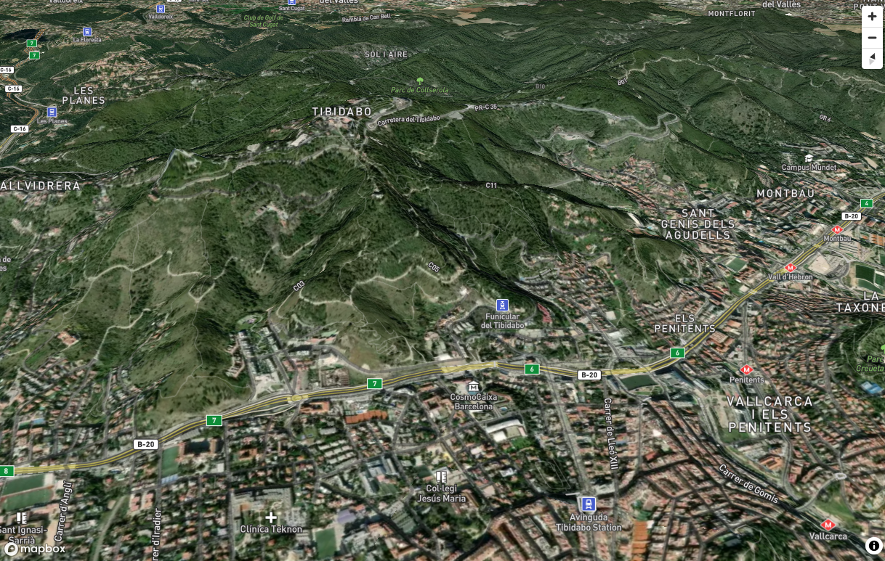

## Introducción

Gracias a la poténcia de WebGL y los nuevos navegadores , cada vez hay más librerias geoweb con capacidades 3D

La visualización 3D no sólo se limita a la extrusión del terreno síno que va más allá, como por ejemplo visualización de nubes de puntos [lidar](http://betaserver.icgc.cat/potree/examples/gironaen3d.html){target=_blank} , visión hiperrealista de [ciudades](http://betaserver.icgc.cat/cesium/Girona3D.html){target=_blank}


## Algunas librerías geo con capacidades 3D

[MapBox GL JS](https://www.mapbox.com/blog/mapbox-gl-js-v2-3d-maps-camera-api-sky-api-launch){target=_blank}

[Cesium JS](https://cesium.com/){target=_blank}

[Deck.GL](https://deck.gl/){target=_blank}

[Procedural](https://www.procedural.eu/){target=_blank}

[Threejs](https://threejs.org/){target=_blank}

[Potree](https://github.com/potree/potree/){target=_blank}

[ArcGis API JavaScript](https://www.esri.com/arcgis-blog/products/js-api-arcgis/3d-gis/arcgis-api-for-javascript-camera-intro/){target=_blank}

## Algunos formatos 3D geo

 **3D-Tiles**: Especificación estándar OGC creada por Cesium para la creación de piràmides de datos vectores con información 3D .

 **3D Scene Layers (I3S)**:Especificación estándar OGC creada por ESRI para la creación de piràmides de datos vectores con información 3D

 **Terrain-RGB**: Datos de elevación codificados en teselas PNG rasterizadas como valores de color que pueden ser decodificados a alturas en metros
 Formula para pasar el color a metros :
 ``` height = -10000 + ((R * 256 * 256 + G * 256 + B) * 0.1)  ```


>Mapbox puede extrudir polígonos

>Mostrar el terreno en 3D

>Mostar objectos y textura 3D [https://openicgc.github.io/icgc-model3d.html](https://openicgc.github.io/icgc-model3d.html){target=_blank}


### Cómo ver un mapa 3D en Mapbox GL

!!! note "Método setTerrain [https://docs.mapbox.com/mapbox-gl-js/api/map/#map#setterrain](https://docs.mapbox.com/mapbox-gl-js/api/map/#map#setterrain){target=_blank}"

#### Paso 1 : Creamos con VSCode **mapa3d.html**

* Vamos a VSCode y creamos el archivo **mapa3d.html** dentro de **/geoweb**


```html
    <html>
    <head>
    <meta charset='utf-8' />
    <title>Mapa 3D</title>
    <meta name='viewport' content='initial-scale=1,maximum-scale=1,user-scalable=no' />
    <script src='https://api.mapbox.com/mapbox-gl-js/v2.0.1/mapbox-gl.js'></script>
    <link href='https://api.mapbox.com/mapbox-gl-js/v2.0.1/mapbox-gl.css' rel='stylesheet' />
    <link href='css/estilobase.css' rel='stylesheet' />
 
    <script src='js/3d.js'></script>
    <script>
        //Añadir vuestor token!!
        var map;
        function init() {
            mapboxgl.accessToken =
                'pk.eyJ1IjoiZ2lzbWFzdGVybTIiLCJhIjoiY2plZHhubTQxMTNoYzMza3Rqa3kxYTdrOCJ9.53B1E6mKD_EQOVb2Y0-SsA';
             map = new mapboxgl.Map({
                container: 'map',
                style: 'mapbox://styles/mapbox/satellite-streets-v10',
                center: [2.16859, 41.3954],
                zoom: 12,
                attributionControl: false,
                pitch: 45,
                hash: true
            });

            map.addControl(new mapboxgl.AttributionControl({ compact: true }));
            map.addControl(new mapboxgl.NavigationControl());

        } // final init
    </script>
    </head>

    <body onload="init()">
        
        <div id="map"></div>
    </body>

    </html>

```

#### Paso 3: Creamos archivo 3d.js

 * Dentro de nuestro directorio **/geoweb/js/** creamos el archivo **3d.js**, dónde crearemos funciones especificas de nuestro proyecto  

 * Creamos la función **add3D()**

```javascript

   function add3D() {

    map.addSource('mapbox-dem', {
        'type': 'raster-dem',
        'url': 'mapbox://mapbox.mapbox-terrain-dem-v1',
        'tileSize': 512,
        'maxzoom': 14
    });
    
    map.setTerrain({
        'source': 'mapbox-dem',
        'exaggeration': 1.5
    });

    
    map.addLayer({
        'id': 'sky',
        'type': 'sky',
        'paint': {
            'sky-type': 'atmosphere',
            'sky-atmosphere-sun': [0.0, 0.0],
            'sky-atmosphere-sun-intensity': 15
        }
    });

} //fin funcion

```
    

#### Paso 4: Llamamos funciones en el evento load de map

 * Llamamos a la función **add3D()**


``` html hl_lines="30 31 32"
    <html>
    <head>
    <meta charset='utf-8' />
    <title>Mapa 3D</title>
    <meta name='viewport' content='initial-scale=1,maximum-scale=1,user-scalable=no' />
    <script src='https://api.mapbox.com/mapbox-gl-js/v2.0.1/mapbox-gl.js'></script>
    <link href='https://api.mapbox.com/mapbox-gl-js/v2.0.1/mapbox-gl.css' rel='stylesheet' />
    <link href='css/estilobase.css' rel='stylesheet' />
 
    <script src='js/3d.js'></script>
    <script>
        //Añadir vuestor token!!
        var map;
        function init() {
            mapboxgl.accessToken =
                'pk.eyJ1IjoiZ2lzbWFzdGVybTIiLCJhIjoiY2plZHhubTQxMTNoYzMza3Rqa3kxYTdrOCJ9.53B1E6mKD_EQOVb2Y0-SsA';
             map = new mapboxgl.Map({
                container: 'map',
                style: 'mapbox://styles/mapbox/satellite-streets-v10',
                center: [2.16859, 41.3954],
                zoom: 12,
                attributionControl: false,
                pitch: 45,
                hash: true
            });

            map.addControl(new mapboxgl.AttributionControl({ compact: true }));
            map.addControl(new mapboxgl.NavigationControl());

            map.on('load', function () {
             add3D();
            }); //fin onload

        } // final init
    </script>
    </head>

    <body onload="init()">
        
        <div id="map"></div>
    </body>

    </html>

```

!!! success "visualizamos el mapa"



#### Paso 5: Añadimos función add3DICGC() a 3d.js

 * Mapbox utiliza un DEM de 10m y de 30 m según zonas del mundo

 * El ICGC publica uno de 2m para Catalunya  

 * Creamos la función **add3DICGC()** con el DEM de 2M

```javascript

   function add3DICGC() {

    map.addSource('icgc-dem', {
        'type': 'raster-dem',
        "tiles": [
        "https://tilemaps.icgc.cat/tileserver/tileserver.php/terreny_icgc_2m_rgb/{z}/{x}/{y}.png"
      ],
        'tileSize': 512,
        'maxzoom': 14
    });

    map.setTerrain({
        'source': 'icgc-dem',
        'exaggeration': 1.5
    });


    map.addLayer({
        'id': 'sky',
        'type': 'sky',
        'paint': {
            'sky-type': 'atmosphere',
            'sky-atmosphere-sun': [0.0, 0.0],
            'sky-atmosphere-sun-intensity': 15
        }
    });

} //fin funcion

```


#### Paso 6:Llamamos a la función en el HTML (solo un de las dos puede ser llamada)


``` html hl_lines="31 32"
    <html>
    <head>
    <meta charset='utf-8' />
    <title>Mapa 3D</title>
    <meta name='viewport' content='initial-scale=1,maximum-scale=1,user-scalable=no' />
    <script src='https://api.mapbox.com/mapbox-gl-js/v2.0.1/mapbox-gl.js'></script>
    <link href='https://api.mapbox.com/mapbox-gl-js/v2.0.1/mapbox-gl.css' rel='stylesheet' />
    <link href='css/estilobase.css' rel='stylesheet' />
 
    <script src='js/3d.js'></script>
    <script>
        //Añadir vuestor token!!
        var map;
        function init() {
            mapboxgl.accessToken =
                'pk.eyJ1IjoiZ2lzbWFzdGVybTIiLCJhIjoiY2plZHhubTQxMTNoYzMza3Rqa3kxYTdrOCJ9.53B1E6mKD_EQOVb2Y0-SsA';
             map = new mapboxgl.Map({
                container: 'map',
                style: 'mapbox://styles/mapbox/satellite-streets-v10',
                center: [2.16859, 41.3954],
                zoom: 12,
                attributionControl: false,
                pitch: 45,
                hash: true
            });

            map.addControl(new mapboxgl.AttributionControl({ compact: true }));
            map.addControl(new mapboxgl.NavigationControl());

            map.on('load', function () {
             //add3D();
             add3DICGC();
            }); //fin onload

        } // final init
    </script>
    </head>

    <body onload="init()">
        
        <div id="map"></div>
    </body>

    </html>

```

!!! success "Comparamos zona Montserrat"

!!! question "¿Cómo haríamos para poner una opción para activar/desactivar vista 3D?"
    Sabémos que  ```map.setTerrain(null)``` desactiva el 3D

!!! question "¿Podríamos pasar a 3D el visor de edificios de Catastro?¿Cómo?"

!!! warning "Para trabajar con 3D hay que cambir un poco la función de popup"

    ```javascript

function addPopupToMapEdificios3D(nombreCapa) {

    map.on('click', function (e) {

        var text = "";
        var bbox = [[e.point.x - 5, e.point.y - 5], [e.point.x + 5, e.point.y + 5]];
    var features = map.queryRenderedFeatures(bbox, { layers: [nombreCapa] });
        
if(features.length > 0){
        for (key in features[0].properties) {

            if (key == "numberOfFl") {
                text += "<b>Numero de plantas</b>:" + features[0].properties[key] + "<br>";
            }
            if (key == "localId") {
                //localId 0004702DF3800C_part1
                //http://ovc.catastro.meh.es/OVCServWeb/OVCWcfLibres/OVCFotoFachada.svc/RecuperarFotoFachadaGet?ReferenciaCatastral=0004701DF3800C
                //https://www1.sedecatastro.gob.es/CYCBienInmueble/OVCListaBienes.aspx?rc1=0004701&rc2=DF3800C

                var localId = features[0].properties[key];

                var localIdSplit = localId.split("_"); // 0004702DF3800C  part1
                var parte1 = localIdSplit[0].substring(0, 7);
                var parte2 = localIdSplit[0].substring(7, localIdSplit[0].length);
                text += "<br>";
                text += "<a target=blank href=https://www1.sedecatastro.gob.es/CYCBienInmueble/OVCListaBienes.aspx?rc1=" + parte1 + "&rc2=" + parte2 + ">Ficha</a><br>";

            }


        }
        new mapboxgl.Popup()
            .setLngLat(e.lngLat)
            .setHTML(text)
            .addTo(map);
}

    });

    map.on('mouseenter', nombreCapa, function () {
        map.getCanvas().style.cursor = 'pointer';
    });

    map.on('mouseleave', nombreCapa, function () {
        map.getCanvas().style.cursor = '';
    });

}

```

!!! success "Editamos index.html y subimos el ejemplo al GitHub"
	
	```bash

		git pull
        git add .
        git commit -m "visor 3d"
        git push

	``` 
