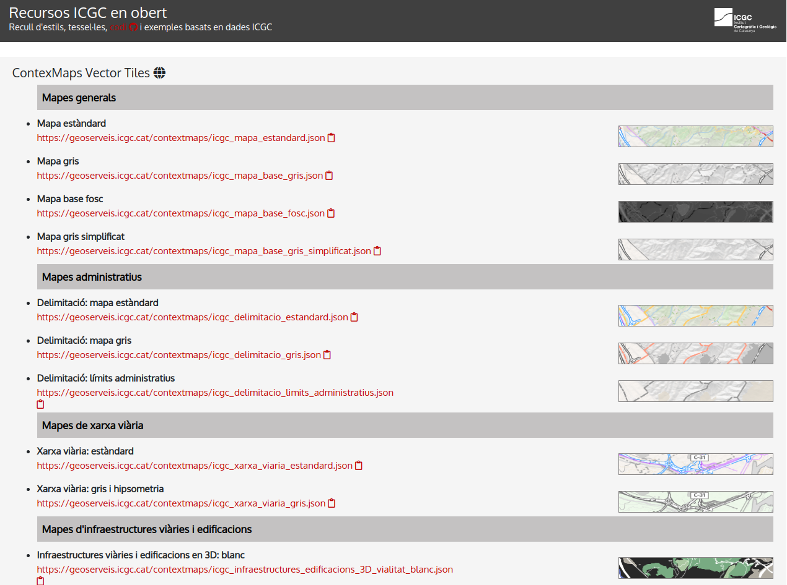

### Introducción

>Podemos trabajar con la libreria MapBox GL JS sin utilizar los estilos , servicios ni app Tokens de Mapbox

>Podemos editar estilos sin utilizar MapBox Studio, directamente con Maputnik


[https://maputnik.github.io/](https://maputnik.github.io//)

#### ¿ Cuando utilizar los servicios de MapBox?

* Cuando tenemos un dataset grande.Mapbox nos ofrece hasta 50 GB gratis

* Cuando necesitamos utilitzar alguno de sus servicios (geocoding, routing) o sus estilos

* Cuando necesitamos alta disponibilidad

#### ¿ Cuando utilizar los servicios de MapBox?

* Cuando necesito trabajor con cartografia oficial
* Cuando tengo dataset pequeños (< 50.000 geometrias)
* Cuando solos visualizo terceros servicios

### OpenICGC

* Es un web con recursos y servicios open del Institut Cartográfic i Geològic de Catalunya

* Presenta estilos y bases **Vector Tiles** mundiales dónde fusiona datos OSM y del ICGC en un esquema de OpenMapTiles

>[https://openicgc.github.io/](https://openicgc.github.io/)



#### Mapa estilo Híbrido

* Seleccionaremos el estilo Hibrid de OpenICGC

* https://geoserveis.icgc.cat/contextmaps/hibrid.json

* Creamos archivo **mapbox-icgc.html**

```html
<html>
<head>
    <meta charset='utf-8' />
    <title>Hibrido</title>
    <meta name='viewport' content='initial-scale=1,maximum-scale=1,user-scalable=no' />
    <script src='https://api.mapbox.com/mapbox-gl-js/v2.0.1/mapbox-gl.js'></script>
    <link href='https://api.mapbox.com/mapbox-gl-js/v2.0.1/mapbox-gl.css' rel='stylesheet' />
    <style>
        body {
            margin: 0;
            padding: 0;
        }
        #map {
            position: absolute;
            top: 0;
            bottom: 0;
            width: 100%;
            height: 100%
        }
    </style>
    <script>
        function Init() {

            mapboxgl.accessToken ='pk.eyJ1IjoiZ2lzbWFzdGVybTIiLCJhIjoiY2plZHhubTQxMTNoYzMza3Rqa3kxYTdrOCJ9.53B1E6mKD_EQOVb2Y0-SsA';
            var map = new mapboxgl.Map({
                container: 'map',
                style: 'https://geoserveis.icgc.cat/contextmaps/hibrid.json',
                center: [2.16859, 41.3954],
                zoom: 13,
                hash: true,
                pitch: 45,
                attributionControl: false
            });
            map.addControl(new mapboxgl.AttributionControl({
                compact: true
            }));
            map.addControl(new mapboxgl.NavigationControl());

           
        }
    </script>
</head>
<body onload="Init()">
    <div id='map'></div>
</body>
</html>
```

#### Crear nuestro propio estilo

* Seleccionaremos el estilo Full dark de OpenICGC

* https://geoserveis.icgc.cat/contextmaps/fulldark.json

* Vamos al editor de Maputnik [https://maputnik.github.io/editor/](https://maputnik.github.io/editor/)

* `Open` --> `Load from Url` -->Pegamos URL  --> `Open URL`

* Canviamos colores del estilos de forma libre

* `Export`-->`Download`--> Guardamos en **/geoweb/datos/miestilo.json**

!!! success "¿Subimos el estilo al GitHub?"
	
	```bash

		git pull
        git add .
        git commit -m "mi estilo"
        git push

	```      
 
#### Mapa estilo propio


* Creamos archivo **mapbox-miestilo2.html**

```html
<html>
<head>
    <meta charset='utf-8' />
    <title>Mi estilo</title>
    <meta name='viewport' content='initial-scale=1,maximum-scale=1,user-scalable=no' />
    <script src='https://api.mapbox.com/mapbox-gl-js/v2.0.1/mapbox-gl.js'></script>
    <link href='https://api.mapbox.com/mapbox-gl-js/v2.0.1/mapbox-gl.css' rel='stylesheet' />
    <style>
        body {
            margin: 0;
            padding: 0;
        }
        #map {
            position: absolute;
            top: 0;
            bottom: 0;
            width: 100%;
            height: 100%
        }
    </style>
    <script>
        function Init() {

            mapboxgl.accessToken ='pk.eyJ1IjoiZ2lzbWFzdGVybTIiLCJhIjoiY2plZHhubTQxMTNoYzMza3Rqa3kxYTdrOCJ9.53B1E6mKD_EQOVb2Y0-SsA';
            var map = new mapboxgl.Map({
                container: 'map',
                style: 'https://gis-master-m2.github.io/geoweb/datos/miestilo.json',
                center: [2.16859, 41.3954],
                zoom: 13,
                hash: true,
                pitch: 45,
                attributionControl: false
            });
            map.addControl(new mapboxgl.AttributionControl({
                compact: true
            }));
            map.addControl(new mapboxgl.NavigationControl());

           
        }
    </script>
</head>
<body onload="Init()">
    <div id='map'></div>
</body>
</html>
```


* Añadimos un GeoJson local , como un nuevo source

!!! tip "GeoJSON"

        Es el constructor principal del mapa [https://docs.mapbox.com/mapbox-gl-js/style-spec/#sources-geojson](https://docs.mapbox.com/mapbox-gl-js/style-spec/#sources-geojson)


```html hl_lines="39 40 41 42 43 44 45 46 47 48 49 50 51 52 53 54 55 56 57 58"

<html>
<head>
    <meta charset='utf-8' />
    <title>Mi estilo</title>
    <meta name='viewport' content='initial-scale=1,maximum-scale=1,user-scalable=no' />
    <script src='https://api.mapbox.com/mapbox-gl-js/v2.0.1/mapbox-gl.js'></script>
    <link href='https://api.mapbox.com/mapbox-gl-js/v2.0.1/mapbox-gl.css' rel='stylesheet' />
    <style>
        body {
            margin: 0;
            padding: 0;
        }
        #map {
            position: absolute;
            top: 0;
            bottom: 0;
            width: 100%;
            height: 100%
        }
    </style>
    <script>
        function Init() {

            mapboxgl.accessToken ='pk.eyJ1IjoiZ2lzbWFzdGVybTIiLCJhIjoiY2plZHhubTQxMTNoYzMza3Rqa3kxYTdrOCJ9.53B1E6mKD_EQOVb2Y0-SsA';
            var map = new mapboxgl.Map({
                container: 'map',
                style: 'https://gis-master-m2.github.io/geoweb/datos/miestilo.json',
                center: [2.16859, 41.3954],
                zoom: 13,
                hash: true,
                pitch: 45,
                attributionControl: false
            });
            map.addControl(new mapboxgl.AttributionControl({
                compact: true
            }));
            map.addControl(new mapboxgl.NavigationControl());

            map.on('load', function () {
                map.addSource("carrils-bici", {
                    type: "geojson",
                    data: "datos/carrils-bici.geojson"
                }); //fin map source

                map.addLayer({
                    id: "carrils-bici-layer",
                    type: "line",
                    source: "carrils-bici",
                    layout: {
                        "line-join": "round",
                        "line-cap": "round"
                    },
                    paint: {
                        "line-color": "#FF0000",
                        "line-width": 8
                    }
                }); //fin add layers
            }); //Fin load mapa

           
        }
    </script>
</head>
<body onload="Init()">
    <div id='map'></div>
</body>
</html>
```


!!! success "¿Subimos el ejemplo al GitHub?"
	
	```bash

		git pull
        git add .
        git commit -m "mi estilo"
        git push

	```      